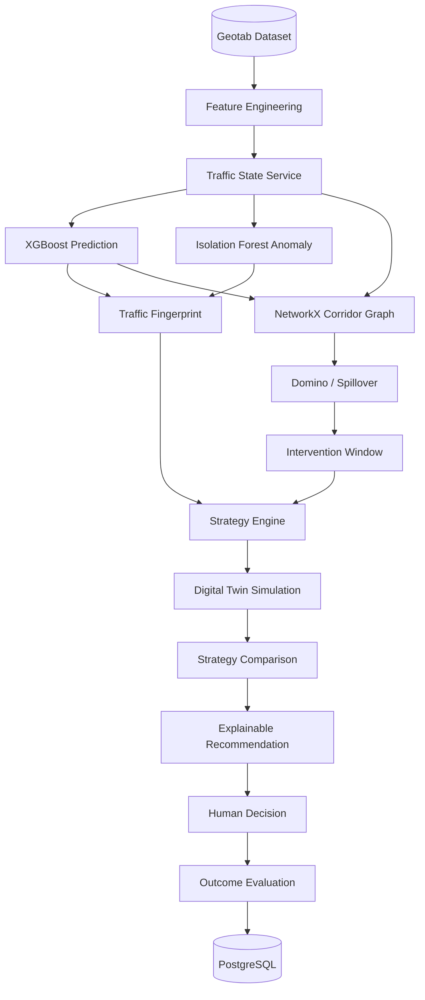

# 00 — MASTER PROJECT SPECIFICATION

| Field | Value |
|---|---|
| Project | NEXUS-TWIN |
| Product | AI Urban Traffic Intelligence |
| Mandatory dataset | BigQuery-Geotab Intersection Congestion Dataset |
| Team size | 3 |
| Status | Architecture frozen. Implementation in progress. |
| Document status | Level-1 (authoritative) |

This is the single source of truth. Where any other document disagrees with this one, this one
wins, and the other document is corrected.

---

## 1. Purpose

Conventional traffic dashboards report where congestion currently is. NEXUS-TWIN answers three
questions instead of one:

| Question | Capability |
|---|---|
| Where is the problem? | Current state, anomaly detection, traffic fingerprint |
| What will happen next? | 5-minute prediction, congestion domino effect |
| When must we act, and what should we do? | Intervention window, strategy generation, Digital Twin, explainable recommendation |

The output of the system is not an alert. It is an evidence-backed recommendation that a human
traffic operator approves, modifies, or rejects.

---

## 2. Scope

### In scope (P0 — must work)

1. Geotab-derived traffic state for the J1–J2–J3 corridor.
2. 5-minute congestion prediction (XGBoost classifier + regressor).
3. Anomaly detection (Isolation Forest).
4. Traffic fingerprint — classification of *what kind* of abnormality is occurring.
5. Congestion domino effect — spillover risk and time-to-impact for neighbouring junctions.
6. Intervention window — how long the operator has before spillover.
7. Strategy generation from a constrained catalogue.
8. Digital Twin what-if simulation of each candidate strategy.
9. Strategy comparison on shared metrics.
10. Explainable recommendation: action, evidence, confidence, trade-offs, safety check.
11. Human decision: approve, override, or compare a human plan.
12. Before/after outcome.

### In scope (P1 — only after all P0 works)

LangGraph agent orchestration, AI Copilot chat surface, 3D Digital Twin (R3F), Server-Sent
Events, AI-vs-Human comparison view, Emergency Corridor mode.

### Out of scope (P2 — do not start)

Redis, Celery/Dramatiq, WebSockets, authentication, RBAC, Sentry, Prometheus, Grafana,
production SUMO calibration, multi-city deployment, mobile app, real-time Geotab ingestion.

### Explicit non-goals

- NEXUS-TWIN does not control real traffic signals.
- NEXUS-TWIN does not claim to replace human traffic operators.
- The LLM does not compute traffic metrics. It explains numbers produced by deterministic tools.

---

## 3. Inputs

| Input | Source | Consumer |
|---|---|---|
| Geotab intersection congestion CSV | Kaggle / BigQuery public dataset | Feature engineering, model training |
| Corridor topology (J1–J2–J3) | `shared_config/ids.yaml` | Graph engine, frontend map |
| Simulation telemetry (SUMO / Python engine) | `simulation/` | Digital Twin, live state |
| Operator decisions | Command Center UI | Outcome evaluation, audit trail |

## 4. Outputs

| Output | Shape | Surface |
|---|---|---|
| Current traffic state | Per-junction metrics | Current State panel, map |
| Prediction | Probability, predicted queue, confidence | AI Forecast panel |
| Anomaly + fingerprint | Class, confidence, supporting signals | Fingerprint panel |
| Domino forecast | Ranked neighbours with risk and ETA | Map overlay + Domino panel |
| Intervention window | Seconds remaining, consequence | Intervention banner |
| Strategy set | 3–4 scored candidates | Strategy panel |
| Simulation results | Per-strategy metrics | Digital Twin panel |
| Recommendation | Action + evidence + confidence + trade-offs + safety | Explanation panel |
| Outcome | Before/after deltas | Outcome panel |

---

## 5. Architecture



Runtime topology, deployment, and process boundaries are specified in
[`03_ARCHITECTURE/SYSTEM_ARCHITECTURE.md`](03_ARCHITECTURE/SYSTEM_ARCHITECTURE.md).

---

## 6. Frozen technology stack

Summary only. The authoritative list, with versions and justifications, is
[`03_ARCHITECTURE/TECH_STACK.md`](03_ARCHITECTURE/TECH_STACK.md).

| Layer | Technology |
|---|---|
| Frontend | Next.js, React, TypeScript, Tailwind, shadcn/ui, Lucide, Framer Motion, Zustand, TanStack Query, Zod, Recharts |
| Geographic | MapLibre GL JS, OpenStreetMap, Deck.gl, Turf.js |
| 3D twin (P1) | Three.js, React Three Fiber, Drei |
| Backend | Python 3.12, FastAPI, Pydantic |
| ML | Pandas, NumPy, scikit-learn, XGBoost, Isolation Forest, SHAP, NetworkX, Joblib |
| Database | PostgreSQL, SQLAlchemy 2.x, Alembic |
| Agents (P1) | LangGraph, LangChain Core, OpenAI API, Pydantic structured outputs |
| Simulation | Phase 1: Python + NumPy + NetworkX. Phase 2 (FUTURE): SUMO + TraCI |
| Realtime | Phase 1: polling / SSE. Phase 2 (FUTURE): WebSockets |

**No technology outside this list may be added** without changing this document first.

---

## 7. Core identifiers

These values are contractual. They appear identically in `shared_config/ids.yaml`, the Pydantic
schemas, and the TypeScript contracts.

```yaml
junctions:      [J1, J2, J3]
strategy_types: [green_extend, diversion, dynamic_lane, emergency_priority, do_nothing]
vehicle_types:  [car, bus, truck, motorcycle, ambulance, police, fire]
incident_types: [accident, closure, surge, weather, emergency]
fingerprints:   [NORMAL, RECURRING_CONGESTION, INCIDENT_LIKE, DEMAND_SURGE, SIGNAL_RELATED, UNKNOWN]
```

Corridor topology: `J1 <-> J2 <-> J3`, with J2 as the central junction and the designated
incident location for the demo scenario.

---

## 8. Team responsibilities and integration boundaries

| Laptop | Owner | Directories | Owns documents |
|---|---|---|---|
| 1 — AI / Data | Member 1 | `data/`, `ai/` | DATASET_SPECIFICATION, DATA_PIPELINE, FEATURE_ENGINEERING, PREDICTION_MODEL, ANOMALY_DETECTION, TRAFFIC_FINGERPRINT, AI_EVALUATION |
| 2 — Backend / Simulation / Agents | Member 2 | `services/api/`, `agents/`, `simulation/`, `database/` | SYSTEM_ARCHITECTURE, API_SPECIFICATION, AGENT_ARCHITECTURE, AGENT_TOOL_CONTRACTS, DOMINO_EFFECT, STRATEGY_ENGINE, DIGITAL_TWIN_SPEC, DATABASE_SCHEMA |
| 3 — Frontend / Integration | You | `apps/web/`, `shared/contracts/` | FRONTEND_ARCHITECTURE, STATE_MANAGEMENT, MAP_ARCHITECTURE, JUDGE_DEMO_SCRIPT, RELEASE_CHECKLIST |

**Integration boundary rule.** The only coupling between laptops is `shared/contracts/`. Nobody
changes a field name, type, or unit in that directory without agreement from the other two. A
rename is a five-minute change for the author and a two-hour outage for everyone else.

---

## 9. MVP definition

The MVP is complete when a judge can, without any explanation from the team, sit at the Command
Center and observe the full nine-state demo scenario producing consistent numbers, with the
Geotab provenance indicator visible, and with the backend switched off.

Concretely:

- [ ] Command Center loads with no console errors.
- [ ] J1–J2–J3 map animates and reflects junction state.
- [ ] Every panel is populated from the provider abstraction, not hardcoded JSX.
- [ ] The demo scenario advances through all nine timeline states.
- [ ] Digital Twin produces different metrics for different strategies.
- [ ] Recommendation cites evidence numbers that match the panels above it.
- [ ] Human override changes the outcome and the outcome panel says so.
- [ ] Refreshing the browser and repeating the demo gives identical results.

---

## 10. Success criteria

| Criterion | Target | Measured by |
|---|---|---|
| Demo completes without intervention | 3 consecutive runs | Manual E2E run |
| Prediction API latency | < 300 ms p95 | Backend timing log |
| Full demo runtime | 5 minutes | Stopwatch against the demo script |
| Dataset influence is demonstrable | Provenance panel traces every model to Geotab columns | DATA_PROVENANCE |
| Console errors | 0 | Browser devtools |
| Model classification F1 (congestion) | ≥ 0.75 on held-out split | AI evaluation script |

---

## 11. Demo flow

The judge-facing scenario is **"J2 Incident — Prevent the Domino"**, nine states:

| # | State | What the judge sees |
|---|---|---|
| 01 | NORMAL | Baseline corridor, stable metrics |
| 02 | ANOMALY | J2 queue rising, speed dropping |
| 03 | FINGERPRINT | `INCIDENT_LIKE`, 91% confidence, supporting signals |
| 04 | PREDICTION | 87% congestion risk at J2 within 5 minutes |
| 05 | SPILLOVER | J1 73% in 4 min, J3 41% in 7 min |
| 06 | RECOMMENDATION | Intervention window 6 min; AI recommends DIVERT TRAFFIC |
| 07 | SIMULATION | Strategies A/B/C simulated and compared |
| 08 | DECISION | Operator approves or overrides |
| 09 | OUTCOME | Before/after: queue, delay, spillover prevented |

Timing and narration: [`13_HACKATHON/JUDGE_DEMO_SCRIPT.md`](13_HACKATHON/JUDGE_DEMO_SCRIPT.md).

---

## 12. Failure modes

| Failure | Behaviour |
|---|---|
| Backend unreachable | Frontend provider falls back to deterministic DEMO data. A small badge reads `DEMO`. The demo still completes. |
| Model artifact missing | Backend serves the deterministic scenario fixture and sets `"degraded": true` in the response. |
| Simulation exceeds time budget | Return partial results with `success: false` and a message; the UI shows the strategies that did complete. |
| LLM API unavailable (P1) | Copilot is hidden. The templated explanation from the XAI engine is used instead. Core pipeline is unaffected. |
| Database unavailable | Read paths continue from in-memory state; writes are dropped with a logged warning. |

**Rule:** no failure in a P1 component may break a P0 path.

---

## 13. Testing

| Level | Tool | Scope |
|---|---|---|
| Unit (backend) | Pytest | Feature engineering, predictor, strategy scoring, graph propagation |
| Contract | Pytest + Zod parse tests | Every API response validates against the shared contract |
| Unit (frontend) | Vitest + React Testing Library | Panels render from provider data |
| E2E | Playwright | Full nine-state demo scenario |
| Manual | Checklist | Judge demo dry-run, twice, on demo hardware |

---

## 14. Acceptance criteria

1. All twelve P0 capabilities are implemented and reachable from the Command Center.
2. The demo runs with the backend stopped, and again with it running, producing the same story.
3. Every number displayed traces to either a model output or a documented deterministic fixture —
   no `Math.random()` anywhere in a demo-critical path.
4. `shared/contracts/` and the Pydantic schemas agree field-for-field.
5. The Geotab provenance panel is present and accurate.
6. No console errors, no unhandled promise rejections, no dead buttons.

---

## 15. Documentation status

| Level | Documents | Status |
|---|---|---|
| Level-1 | Master spec, PRD, problem statement, dataset spec, tech stack, system architecture, AI architecture, agent architecture, API specification, API data contracts, agent tool contracts, data pipeline, data provenance, fingerprint, domino, strategy engine, explainable AI, digital twin spec, frontend architecture, database schema, implementation master plan, git workflow, judge demo script | Written |
| Level-2 | Remaining subsystem documents (component/data/realtime/security architecture, SSE events, feature engineering, validation, prediction & anomaly model specs, AI evaluation, simulation engine, what-if scenarios, SUMO integration, state management, map architecture, 3D twin frontend, migrations, phase documents, testing suite, devops suite, remaining hackathon documents) | Not written — not required before coding |

Level-2 documents describe the production trajectory. They must not be treated as an
implementation backlog for the hackathon.

---

## 16. Future work

- Real-time Geotab ingestion rather than batch CSV.
- SUMO/TraCI as the simulation backend behind the same Digital Twin interface.
- Multi-corridor and multi-city topology.
- Learned spillover propagation instead of the analytic graph model.
- Operator feedback loop: approved and overridden decisions as training signal.
