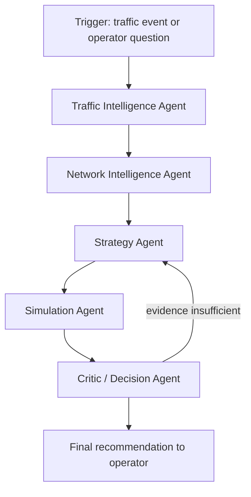

# AGENT ARCHITECTURE

| Field | Value |
|---|---|
| Status | Level-1 (authoritative) |
| Priority | **P1 — build only after every P0 capability works** |
| Owner | Laptop 2 |
| Depends on | `04_API/AGENT_TOOL_CONTRACTS.md`, `AI_ARCHITECTURE.md` |

---

## 1. Purpose

Define a genuine multi-agent workflow — five agents with distinct responsibilities, orchestrated
by LangGraph, each acting only through typed tools that call the real intelligence layer.

## 2. Scope

Orchestration topology, agent responsibilities, state, and guardrails. Tool signatures are in
`AGENT_TOOL_CONTRACTS.md`.

## 3. Two rules that decide whether this is real

1. **Agents call deterministic tools. The LLM never computes a metric.** Every number an agent
   emits was returned by a tool in the same run.
2. **The agent layer is optional.** Every tool is an ordinary FastAPI-callable function. Deleting
   `agents/` must leave the P0 pipeline fully working.

Rule 2 is what prevents an experimental orchestration layer from becoming a single point of
failure for the demo. Rule 1 is what makes the architecture defensible under questioning: without
it, the system is a language model narrating plausible traffic numbers.

---

## 4. Topology



Five agents. Not fifteen. Each maps to a stage of the pipeline that already exists; none was
invented to increase an agent count.

## 5. Agents

### 5.1 Traffic Intelligence Agent

| Field | Value |
|---|---|
| Responsibility | Establish what is happening at the source junction |
| Tools | `get_current_traffic`, `predict_congestion`, `detect_anomaly`, `generate_fingerprint` |
| Writes to state | `traffic_state`, `prediction`, `anomaly`, `fingerprint` |
| Exit condition | Fingerprint produced with a confidence value |

### 5.2 Network Intelligence Agent

| Field | Value |
|---|---|
| Responsibility | Establish where the problem goes next and how long there is to act |
| Tools | `predict_spillover`, `compute_intervention_window` |
| Writes to state | `domino`, `intervention_window` |
| Exit condition | Ranked neighbour risks with ETAs |

### 5.3 Strategy Agent

| Field | Value |
|---|---|
| Responsibility | Produce candidate interventions from the constrained catalogue |
| Tools | `generate_strategies` |
| Writes to state | `candidates[]` |
| Constraint | May only select types in `shared_config/ids.yaml` and may only set parameters within documented bounds. Cannot invent a control action. |
| Exit condition | 3–4 candidates including `do_nothing` |

### 5.4 Simulation Agent

| Field | Value |
|---|---|
| Responsibility | Test each candidate in the Digital Twin and compare |
| Tools | `simulate_strategy`, `compare_strategies` |
| Writes to state | `simulation_results[]`, `comparison` |
| Exit condition | Every candidate has either a result or a recorded failure |

### 5.5 Critic / Decision Agent

| Field | Value |
|---|---|
| Responsibility | Decide whether the evidence supports a recommendation |
| Tools | `explain_recommendation`, `check_safety` |
| Checks | Is the improvement over `do_nothing` material? Does the strategy worsen any other junction? Is emergency access preserved? Is confidence above threshold? |
| Outcome | Recommendation, or a loop back to the Strategy Agent (max 1 retry), or an explicit "no confident recommendation" |

The Critic must be able to return **no recommendation**. An architecture that always produces a
confident answer has no critic in it, only a formatter.

## 6. State

```python
class NexusAgentState(TypedDict):
    session_id: str
    trigger: str
    traffic_state: dict | None
    prediction: dict | None
    anomaly: dict | None
    fingerprint: dict | None
    domino: dict | None
    intervention_window: dict | None
    candidates: list[dict]
    simulation_results: list[dict]
    comparison: dict | None
    recommendation: dict | None
    safety: dict | None
    tool_calls: list[dict]      # full audit trail
    errors: list[str]
    retry_count: int
```

`tool_calls` records every call and result. It is what makes the run auditable and what the
evidence assembler validates explanation numbers against.

## 7. Guardrails

| Guardrail | Enforcement |
|---|---|
| No fabricated metrics | Response assembler cross-checks every numeric token in the explanation against `tool_calls`; unmatched numbers are stripped and the run is flagged |
| Bounded loops | `retry_count ≤ 1`; the graph terminates unconditionally after it |
| Bounded latency | 20 s wall clock per run; on timeout, return the best state reached with `partial: true` |
| Constrained actions | Strategy types validated against `ids.yaml` before simulation |
| Structured output | Every agent returns a Pydantic model, not free text |
| No tool without a contract | Tools are registered from `AGENT_TOOL_CONTRACTS.md` only |

## 8. Interfaces

| Interface | Detail |
|---|---|
| `POST /api/copilot/query` | Operator question → agent run → structured answer |
| Internal | `run_agent_workflow(session_id, trigger) -> NexusAgentState` |
| Tools | Direct Python calls into `ai/`, `simulation/`, and the graph engine |
| Persistence | `agent_runs` and `copilot_sessions` tables |

## 9. Dependencies

LangGraph, LangChain Core, OpenAI API, Pydantic. All are P1. The intelligence functions the agents
call have no dependency on any of them.

## 10. Failure modes

| Failure | Behaviour |
|---|---|
| LLM API unavailable | Agent layer disabled at startup; Copilot hidden; templated XAI explanation used |
| Tool raises | Error appended to `errors`, graph continues, Critic accounts for the missing evidence |
| Timeout | Partial state returned, `partial: true`, UI shows what completed |
| Model returns malformed structured output | One reparse attempt, then fall back to the deterministic path |
| Infinite reasoning loop | Prevented by `retry_count` and by the graph having no unbounded cycles |

## 11. Testing

- Each agent tested with mocked tools and asserted state transitions.
- Full-graph test on the demo scenario asserting the terminal state contains a recommendation.
- Fabrication test: assert every number in the generated explanation appears in `tool_calls`.
- Failure injection: each tool made to raise in turn; the graph must still terminate.

## 12. Acceptance criteria

1. Five agents exist, each with a distinct responsibility and its own tools.
2. Removing `agents/` leaves all P0 endpoints working.
3. Every recommendation is reproducible from its `tool_calls` audit trail.
4. The Critic can and does return "no confident recommendation" on weak evidence.

## 13. Future work

LangSmith tracing, checkpointed resumable runs, human-in-the-loop interrupts inside the graph,
learned strategy proposal within the constrained catalogue.
