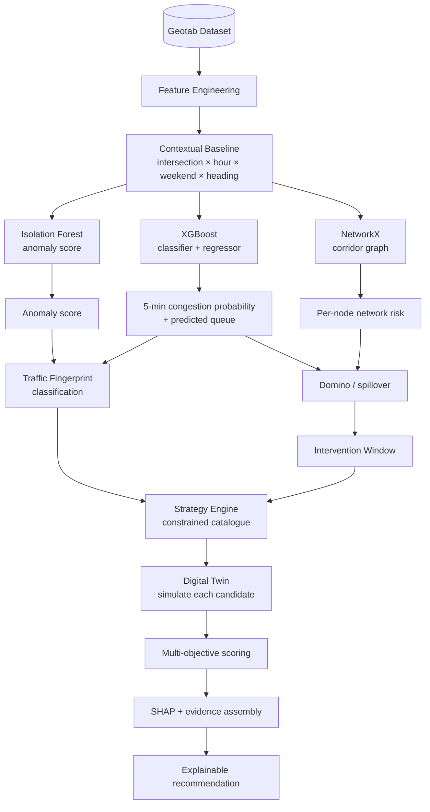

# AI ARCHITECTURE

| Field | Value |
|---|---|
| Status | Level-1 (authoritative) |
| Owner | Laptop 1 (AI / Data), with Laptop 2 for graph and simulation |
| Depends on | `DATASET_SPECIFICATION.md`, `05_DATA/DATA_PIPELINE.md` |

---

## 1. Purpose

Define the actual intelligence in the system: which model produces which output, what each
consumes, and how they compose. This document exists so that no part of the project can describe
itself as "AI analyses traffic" without saying which model, on which features, producing what.

## 2. Scope

Model roles and composition. Training detail belongs to the individual model documents; this is
the map.

---

## 3. Composition



## 4. Models

### 4.1 Congestion prediction — XGBoost

| Property | Value |
|---|---|
| Task | Binary classification (`will_congest_5min`) + regression (`predicted_queue_5min_m`) |
| Library | XGBoost, with scikit-learn `GradientBoosting*` fallback |
| Horizon | 5 minutes |
| Features | `active_vehicles`, `avg_speed_kmh`, `avg_waiting_time_s`, `max_waiting_time_s`, `queue_length_m`, `halting_vehicles`, `previous_queue_m`, `queue_delta`, `signal_phase`, `time_of_day_s`, plus Geotab context: `hour_sin`, `hour_cos`, `is_weekend`, `heading_angle`, `turn_angle`, `baseline_stopped_p50`, `baseline_distance_p50`, `deviation_ratio` |
| Output | `PredictionOutput(predicted_queue_5min_m, will_congest_5min, congestion_probability, confidence_score, feature_importances)` |
| Split | Run-based / intersection-based, never random row shuffle |
| Metrics | Accuracy, precision, recall, F1 for classification; MAE for queue |

Leakage rule: features describe the present and past only. The target is derived from a future
window. Splitting is done by `run_id` (simulation) or by intersection group (Geotab) so the same
context never appears in both train and test.

### 4.2 Anomaly detection — Isolation Forest

| Property | Value |
|---|---|
| Task | Unsupervised outlier scoring |
| Input | Deviation vector: observed metrics minus contextual baseline, standardised |
| Output | `anomaly_score ∈ [0,1]`, `is_anomaly: bool` |
| Contamination | 0.05, fixed and documented |

Trained on the deviation vector rather than raw metrics, because the same absolute queue length is
normal at 08:00 and abnormal at 22:00. Without the contextual baseline, the model would simply
relearn rush hour as an anomaly.

### 4.3 Traffic fingerprint — signal classification

Not a separate learned model in P0. It is a documented, deterministic classifier over the
deviation signals, gated by the Isolation Forest score. Full specification in
`06_AI/TRAFFIC_FINGERPRINT.md`.

| Input | Output |
|---|---|
| Anomaly score, per-signal deviations, prediction trajectory | `type`, `confidence`, `signals[]` |

Determinism is a feature here: a judge asking "why did it say incident?" gets an answer in terms
of named thresholds on named signals.

### 4.4 Network intelligence — NetworkX

| Property | Value |
|---|---|
| Graph | Nodes = junctions (J1, J2, J3); edges = directed links with length, free-flow travel time, capacity |
| Source of geometry | Geotab coordinates and street names |
| Computation | Risk propagation from the source node outward, attenuated by distance and capacity |
| Output | Per-neighbour `risk` and `eta_minutes` |

Specification in `06_AI/DOMINO_EFFECT.md`.

### 4.5 Strategy engine

Constrained catalogue, not free generation. Types: `do_nothing`, `green_extend`, `diversion`,
`dynamic_lane`, `emergency_priority`. `do_nothing` is always included as the control condition —
without a baseline, "improvement" is meaningless. Specification in `06_AI/STRATEGY_ENGINE.md`.

### 4.6 Multi-objective scoring

```
score = w_delay·delay + w_queue·queue + w_spillback·spillback_penalty
      + w_emissions·emissions + w_emergency·emergency_delay
```

Weights (`configs/optimization_weights.json`, currently in use):

| Term | Weight |
|---|---|
| delay | 1.0 |
| queue | 1.0 |
| spillback | 1.5 |
| emissions | 0.5 |
| emergency | 3.0 |

Lower score wins. The spillback penalty is computed against the `do_nothing` baseline: any
junction whose queue is worse than baseline contributes its excess. This is what prevents the
system from recommending an action that helps J2 by wrecking J1.

### 4.7 Explainability — SHAP

SHAP values on the XGBoost classifier supply the evidence lines in the recommendation. Where SHAP
is unavailable, gain-based feature importances are used, and the explanation states which
attribution method produced it.

## 5. What the LLM does and does not do

| The LLM may | The LLM may not |
|---|---|
| Phrase a recommendation in natural language | Compute a probability, queue length, ETA, or score |
| Summarise tool outputs it was given | Invent evidence, or restate a number it was not given |
| Choose which tool to call next (P1) | Choose the recommended strategy without the scoring function |
| Answer operator questions from retrieved tool results | Answer from its own traffic knowledge |

Enforcement is structural: the agent has no metric-producing capability of its own, only typed
tools (`04_API/AGENT_TOOL_CONTRACTS.md`). Every number in an explanation must be traceable to a
tool result in the same request, and the response assembler drops any that is not.

## 6. Model artifacts

| Artifact | Path | Produced by |
|---|---|---|
| `congestion_model.pkl` | `data/` | `ai/prediction/train.py` |
| `anomaly_model.pkl` | `data/` | `ai/anomaly/train.py` |
| `baselines.parquet` | `data/processed/` | `ai/features/build_baselines.py` |
| `corridor_graph.json` | `data/processed/` | `ai/graph/build_graph.py` |

All artifacts are regenerable from raw data by documented commands. Artifacts are git-ignored;
the commands that build them are not.

## 7. Evaluation

| Model | Metric | Target |
|---|---|---|
| Congestion classifier | F1 | ≥ 0.75 held-out |
| Queue regressor | MAE | ≤ 20% of mean queue |
| Anomaly detector | Detection of injected incidents | ≥ 0.90 recall on synthetic incidents |
| Fingerprint | Agreement with scenario ground truth | ≥ 0.80 on the labelled scenario set |
| Domino | Predicted vs simulated spillover order | Correct ranking in ≥ 0.80 of runs |

Every metric is written to `results/` as JSON so it can be shown to a judge rather than asserted.

## 8. Failure modes

| Failure | Behaviour |
|---|---|
| Model artifact missing | Load fallback: deterministic scenario values, response flagged `degraded: true` |
| XGBoost not installed | scikit-learn gradient boosting, logged at startup |
| SHAP fails or is slow | Fall back to gain importances; explanation names the method |
| Feature vector has nulls | Impute from contextual baseline; if the baseline is missing, refuse and return the fallback |
| Anomaly score saturates | Fingerprint returns `UNKNOWN` with low confidence rather than guessing a class |

`UNKNOWN` is a valid, expected output. A classifier that always produces a confident class is not
more useful, only less honest.

## 9. Testing

- Unit tests per model on fixed inputs with asserted outputs.
- Leakage test: assert no target-derived column is in `FEATURE_COLS`.
- Determinism test: same input, same seed, identical output across runs.
- Contract test: model outputs validate against the Pydantic response models.

## 10. Acceptance criteria

1. Every arrow in section 3 corresponds to a real function call in the codebase.
2. All five evaluation metrics are produced and stored in `results/`.
3. Deleting the Geotab-derived baselines visibly degrades prediction and anomaly output.
4. No LLM-produced number appears in any panel.

## 11. Future work

Graph neural network for learned propagation; sequence models for multi-horizon forecasting;
online learning from operator overrides; conformal prediction intervals instead of a scalar
confidence.
