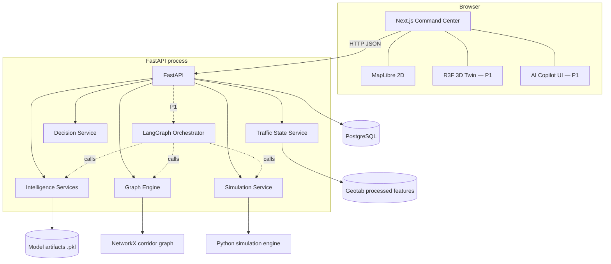
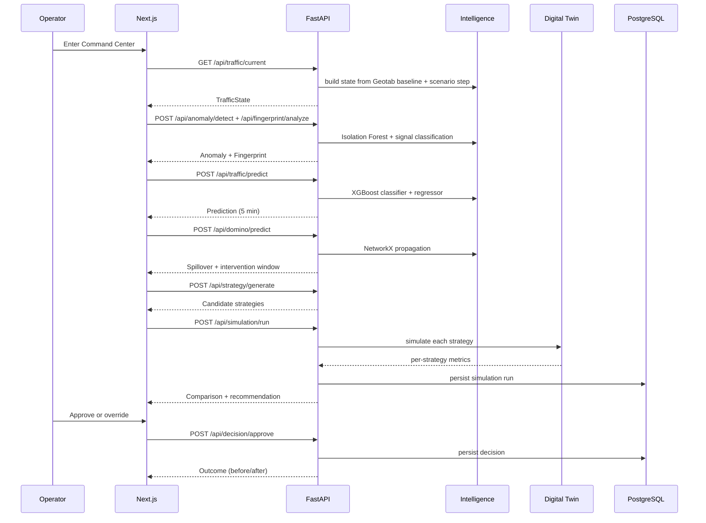

# SYSTEM ARCHITECTURE

| Field | Value |
|---|---|
| Status | Level-1 (authoritative) |
| Owner | Laptop 2 (Backend) |
| Depends on | `TECH_STACK.md`, `00_MASTER_PROJECT_SPEC.md` |

---

## 1. Purpose

Define the runtime topology: which processes exist, what each owns, how they communicate, and
what happens when one of them is missing.

## 2. Scope

Process boundaries, request flow, module layout, and degradation behaviour. Endpoint payloads are
in `04_API/API_SPECIFICATION.md`; model internals are in `06_AI/`.

---

## 3. Topology



Three processes only: browser, FastAPI, PostgreSQL. Everything else is a module inside FastAPI.
A microservice split would cost more in orchestration than it returns within the timebox.

## 4. Processes

| Process | Port | Owner | Responsibility |
|---|---|---|---|
| Next.js | 3000 | Laptop 3 | All rendering, interaction, and the provider abstraction |
| FastAPI | 8000 | Laptop 2 | All intelligence, simulation, and persistence |
| PostgreSQL | 5432 | Laptop 2 | Persistent runs, predictions, decisions |

## 5. Backend module layout

```
services/api/
├── main.py                 App factory, CORS, router registration
├── routers/
│   ├── health.py
│   ├── traffic.py          state, predict
│   ├── anomaly.py          detect, fingerprint
│   ├── network.py          domino, intervention window
│   ├── strategy.py         generate, evaluate, apply
│   ├── simulation.py       run, get
│   ├── decision.py         evaluate, approve
│   └── copilot.py          P1
├── services/               orchestration between routers and ai/
├── schemas/                Pydantic request and response models
└── deps.py                 Singletons: models, graph, engine

ai/                         Owned by Laptop 1, imported by services
simulation/                 Owned by Laptop 2
agents/                     P1
```

Routers contain no logic. They validate, call a service, and return. Every piece of intelligence
lives in a plain Python function that can be unit-tested and called by an agent tool.

## 6. Request flow — the demo path



State is held server-side in a `ScenarioSession` keyed by `session_id`, so every panel in one
browser session sees a consistent world. The frontend sends `session_id` with each call.

## 7. Data provider abstraction

The frontend never branches on data origin.

```
components -> useTrafficState() -> provider -> { LIVE: httpClient, DEMO: fixtures }
```

| Mode | Source | Selection |
|---|---|---|
| `LIVE` | FastAPI | Default when `/api/health` responds within 1.5 s |
| `DEMO` | Deterministic fixtures in `apps/web/src/lib/demo/` | Health check fails, or `?mode=demo` |

Every fixture is generated from the same scenario definition the backend uses, so the two modes
tell the same story with the same numbers.

## 8. Compatibility with the existing backend

An earlier backend exists and serves the Unity prototype. It must keep working.

| Existing route | Status | New route |
|---|---|---|
| `GET /health` | Keep | also `GET /api/health` |
| `GET /api/status` | Keep | — |
| `GET /traffic/state`, `GET /api/state` | Keep as aliases | `GET /api/traffic/current` |
| `GET /traffic/prediction` | Keep as alias | `POST /api/traffic/predict` |
| `GET /recommendation` | Keep as alias | `POST /api/decision/evaluate` |
| `POST /strategy/evaluate`, `POST /api/evaluate` | Keep | `POST /api/simulation/run` |
| `POST /strategy/apply` | Keep | `POST /api/decision/approve` |
| `POST /incident/trigger` | Keep | — |
| `POST /api/emergency` | Keep | — |
| `POST /api/game/*` | Keep, unused by the web client | — |
| `WS /ws/traffic`, `WS /ws` | Keep for Unity | Web client does not use WebSockets in P0 |

Rule: **add routers, do not rewrite `main.py`.** Discover existing routes before creating a
duplicate endpoint.

## 9. Interfaces

| Interface | Protocol | Contract |
|---|---|---|
| Browser → API | HTTP/JSON | `04_API/API_SPECIFICATION.md` |
| API → models | Python function calls | `06_AI/` |
| API → simulation | Python function calls | `07_SIMULATION/DIGITAL_TWIN_SPEC.md` |
| API → database | SQLAlchemy | `09_DATABASE/DATABASE_SCHEMA.md` |
| Agent → tools | Pydantic-typed calls | `04_API/AGENT_TOOL_CONTRACTS.md` |

## 10. Failure modes

| Component down | System behaviour | Demo impact |
|---|---|---|
| PostgreSQL | In-memory session state; writes logged and dropped | None |
| Model artifacts | Deterministic scenario fixture, `degraded: true` | None visible |
| Simulation engine | Cached scenario results returned with `success: false` per failed strategy | Comparison shows fewer strategies |
| FastAPI | Frontend switches to `DEMO` | None |
| LLM (P1) | Copilot hidden, templated explanation used | None |
| Next.js | No demo | Total — mitigated by running a second machine with the same build |

Startup order is irrelevant: the frontend runs without the backend, and the backend runs without
the database.

## 11. Testing

- `pytest` contract tests asserting every response validates against its Pydantic model.
- A smoke test that starts the app with model artifacts removed and asserts a 200 with
  `degraded: true`.
- Playwright run with the backend stopped, asserting the full demo still completes.

## 12. Acceptance criteria

1. Frontend and backend start independently and neither blocks the other.
2. All legacy routes still return their previous shapes.
3. Killing PostgreSQL mid-demo does not produce a visible error.
4. `session_id` produces consistent state across all panels.

## 13. Future work

SSE event stream, split of simulation into a worker process, Redis-backed session state,
containerised deployment behind a reverse proxy.
