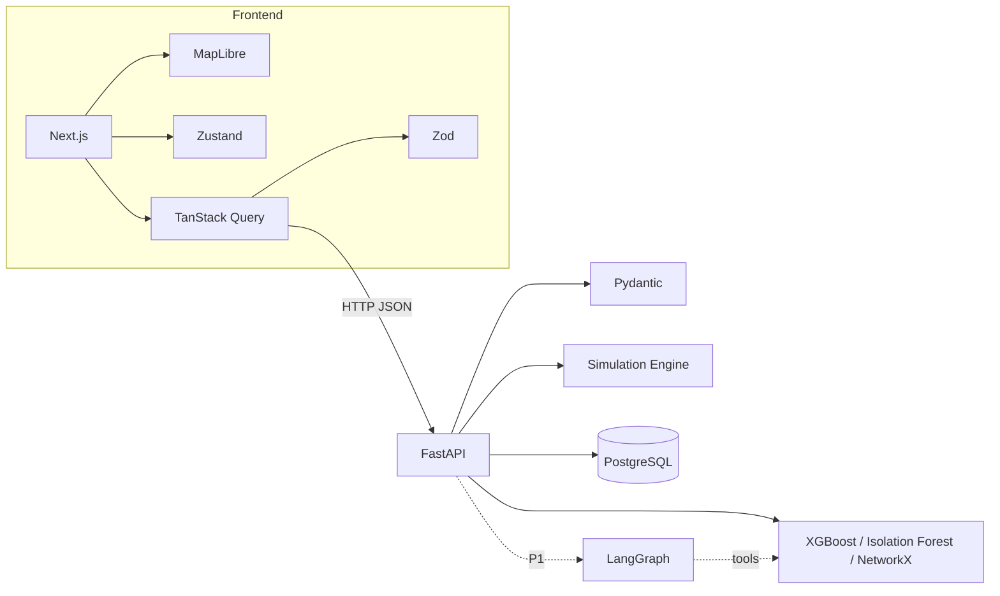

# TECH STACK — FROZEN

| Field | Value |
|---|---|
| Status | Level-1 (authoritative). **Frozen.** |
| Owner | Shared |
| Change process | Amend this document first, with all three members agreeing, before installing anything |

---

## 1. Purpose

Fix the technology choices so that no time is spent re-litigating them, and so that each
technology has exactly one responsibility. Production-grade means every tool has a clear job, not
that every possible tool is present.

## 2. The rule

> If a library is not in this document, it is not in the project.

Adding a dependency mid-hackathon costs more than the problem it solves, because it must be
installed on three machines, documented, and integrated under time pressure.

---

## 3. Frontend

| Technology | Responsibility | Priority |
|---|---|---|
| Next.js (App Router) | Application shell, routing, build | MUST |
| React + TypeScript | Components and type safety | MUST |
| Tailwind CSS | Styling | MUST |
| shadcn/ui | Base components (card, tabs, dialog, badge) | MUST |
| Lucide React | Icons | MUST |
| Framer Motion | Panel transitions, domino arrow animation | MUST |
| Zustand | Client state: scenario step, selected strategy, decision | MUST |
| TanStack Query | Server state: fetching, caching, retry, fallback | MUST |
| Zod | Runtime validation of every API response | MUST |
| Recharts | Before/after and strategy comparison charts | SHOULD |

State split: **Zustand owns what the user did. TanStack Query owns what the server said.** No
server response is copied into Zustand.

## 4. Geographic visualisation

| Technology | Responsibility | Priority |
|---|---|---|
| MapLibre GL JS | Base map rendering | MUST |
| OpenStreetMap tiles | Base geography | MUST |
| Deck.gl | Junction, congestion, and spillover layers | SHOULD |
| Turf.js | Distance, bearing, and interpolation along links | SHOULD |

If Deck.gl integration is not working within its timebox, fall back to MapLibre GeoJSON layers.
The domino visualisation must not depend on Deck.gl succeeding.

## 5. 3D Digital Twin (P1)

| Technology | Responsibility | Priority |
|---|---|---|
| Three.js | 3D engine | OPTIONAL (P1) |
| React Three Fiber | React bindings | OPTIONAL (P1) |
| Drei | Camera, controls, environment helpers | OPTIONAL (P1) |

Build a **stylised** traffic twin — abstract roads, simple vehicle instances, clear state colours.
Do not attempt a realistic 3D city: it is slower to build, heavier to render, and looks worse than
a clean stylised scene.

## 6. Backend

| Technology | Responsibility | Priority |
|---|---|---|
| Python 3.12 | Runtime | MUST |
| FastAPI | HTTP API, OpenAPI schema generation | MUST |
| Pydantic v2 | Request/response validation, structured outputs | MUST |
| Uvicorn | ASGI server | MUST |
| FastAPI BackgroundTasks | Lightweight async work | SHOULD |

## 7. Machine learning

| Technology | Responsibility | Priority |
|---|---|---|
| Pandas | Dataset processing | MUST |
| NumPy | Numerical work, simulation core | MUST |
| scikit-learn | Pipelines, scaling, metrics, Isolation Forest | MUST |
| XGBoost | Congestion classifier and queue regressor | MUST |
| SHAP | Feature attribution for explanations | SHOULD |
| NetworkX | Corridor graph, propagation, shortest paths | MUST |
| Joblib | Model serialisation | MUST |

`GradientBoosting*` from scikit-learn is the documented fallback if XGBoost cannot be installed on
a machine — the existing predictor already implements this path.

## 8. Database

| Technology | Responsibility | Priority |
|---|---|---|
| PostgreSQL (current supported major release) | Persistent storage | MUST |
| SQLAlchemy 2.x | ORM | MUST |
| Alembic | Migrations | MUST |
| DBeaver | Local inspection | OPTIONAL |

Use a currently supported PostgreSQL major version and keep to its latest minor release.

## 9. Agent layer (P1)

| Technology | Responsibility | Priority |
|---|---|---|
| LangGraph | Orchestration of the five-agent workflow | OPTIONAL (P1) |
| LangChain Core | Tool definitions and LLM bindings | OPTIONAL (P1) |
| OpenAI API | Reasoning, structured outputs, tool calling | OPTIONAL (P1) |
| Pydantic | Structured tool inputs and outputs | MUST |

**Constraint:** LangGraph is the orchestration layer, never a dependency of the intelligence
itself. Every tool it calls must be independently callable from FastAPI without LangGraph
installed. If the agent layer is deleted, the P0 pipeline still works.

## 10. Simulation

| Phase | Technology | Priority |
|---|---|---|
| Phase 1 | Python + NumPy + NetworkX custom engine | MUST |
| Phase 2 | SUMO + TraCI | FUTURE |

SUMO network files already exist in `simulation/network/` from earlier work and may be reused, but
the Digital Twin interface must not require SUMO to be running.

## 11. Realtime

| Phase | Technology | Priority |
|---|---|---|
| Phase 0 | TanStack Query polling (2 s) | MUST |
| Phase 1 | Server-Sent Events | OPTIONAL (P1) |
| Phase 2 | WebSockets | FUTURE |

Polling is sufficient for a five-minute demo. SSE is an upgrade, not a prerequisite.

## 12. Testing and quality

| Area | Technology | Priority |
|---|---|---|
| Frontend unit | Vitest + React Testing Library | SHOULD |
| E2E | Playwright | SHOULD |
| Backend | Pytest + HTTPX test client | MUST |
| Python lint/format | Ruff | SHOULD |
| TS lint/format | ESLint + Prettier | SHOULD |

## 13. DevOps

| Technology | Responsibility | Priority |
|---|---|---|
| Git + GitHub | Version control | MUST |
| Docker + Docker Compose | Reproducible local environment across three machines | SHOULD |
| GitHub Actions | Lint and test on PR | OPTIONAL |

## 14. Explicitly excluded

Redis, Celery, Dramatiq, WebSockets, Auth.js, RBAC, Sentry, Prometheus, Grafana, PostGIS,
Kubernetes, a second UI library, a second state library, a second charting library.

Each of these has a legitimate production use and no hackathon use.

## 15. Dependencies between layers

## 16. Failure modes

| Failure | Mitigation |
|---|---|
| XGBoost install fails | scikit-learn `GradientBoosting*` fallback, already implemented |
| Deck.gl integration fails | MapLibre GeoJSON layers |
| PostgreSQL unavailable | SQLite for local dev; the schema uses no Postgres-specific types in P0 tables |
| OpenAI API unavailable | Templated explanations from the XAI engine |
| Node version mismatch | Pin the Node version in `.nvmrc` and the Dockerfile |

## 17. Testing

`docker compose up` on a clean machine must produce a working frontend and backend. This is
verified once per member before Phase 3 begins.

## 18. Acceptance criteria

1. `package.json` and `requirements.txt` contain nothing outside this document.
2. Every member can run the full stack locally.
3. Removing the agent layer does not break any P0 endpoint.

## 19. Future work

SUMO/TraCI simulation backend, SSE then WebSockets, Redis caching for repeated predictions,
LangSmith tracing, containerised deployment.
