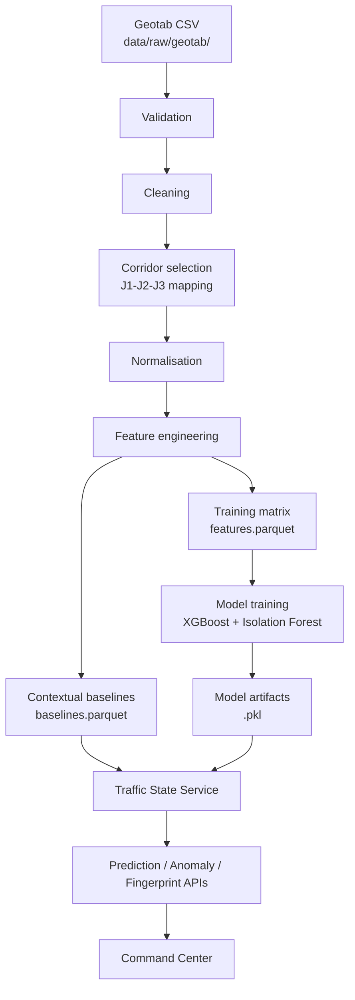

# DATA PIPELINE

| Field | Value |
|---|---|
| Status | Level-1 (authoritative) |
| Owner | Laptop 1 (AI / Data) |
| Depends on | `02_RESEARCH/DATASET_SPECIFICATION.md` |

---

## 1. Purpose

Show exactly how the competition dataset enters the system and reaches the Command Center, with
every stage reproducible by a documented command.

## 2. Pipeline



## 3. Stages

### Stage 1 — Ingestion

```bash
python -m ai.data.ingest --source data/raw/geotab/train.csv
```

Reads the raw CSV in chunks. Writes nothing except a validation report. Raw data is never
modified — every later stage reads it fresh.

### Stage 2 — Validation

Gates (from `DATASET_SPECIFICATION.md` §8): required columns present, non-empty, coordinates in
city bounds, percentile monotonicity `p20 ≤ p50 ≤ p80`, null rate ≤ 5%, valid compass headings.

Output: `data/processed/validation_report.json` with row counts in, out, and per-rule drops. A
failed hard gate aborts the pipeline; it does not silently continue with fewer rows.

### Stage 3 — Cleaning

| Issue | Treatment |
|---|---|
| Nulls in target percentiles | Impute with the intersection-hour median; if unavailable, drop |
| Nulls in street names | Fill `"UNKNOWN"`; excluded from graph edge construction |
| Outliers (> 99.9th percentile stopped time) | Winsorise, flagged in the report |
| Duplicate `RowId` | Drop, logged |

### Stage 4 — Corridor selection

```bash
python -m ai.data.select_corridor --city Chicago
```

Produces `data/processed/corridor_mapping.json`:

```json
{
  "city": "Chicago",
  "corridor": [
    { "label": "J1", "intersection_id": 1234, "lat": 41.88, "lon": -87.63, "streets": ["N State St", "W Lake St"] },
    { "label": "J2", "intersection_id": 5678, "lat": 41.88, "lon": -87.63, "streets": ["N State St", "W Randolph St"] },
    { "label": "J3", "intersection_id": 9012, "lat": 41.88, "lon": -87.63, "streets": ["N State St", "W Washington St"] }
  ],
  "links": [ { "from": "J1", "to": "J2", "length_m": 220 }, { "from": "J2", "to": "J3", "length_m": 190 } ]
}
```

Run once, then frozen. Re-running mid-hackathon changes every downstream number.

### Stage 5 — Normalisation

Units converted to the contract: seconds for time, metres for distance, km/h for speed. Headings
encoded as `θ/π` clockwise from north. Turn angle computed as exit minus entry.

### Stage 6 — Feature engineering

| Group | Features |
|---|---|
| Temporal | `hour_sin`, `hour_cos`, `is_weekend`, `month_sin`, `month_cos` |
| Spatial | `intersection_id` (target-encoded), `heading_angle`, `turn_angle`, `distance_to_downtown_km` |
| Congestion | `stopped_p20/50/80`, `distance_first_stop_p20/50/80`, `time_from_first_stop_p50` |
| Baseline | `baseline_stopped_p50`, `baseline_distance_p50` for the intersection-hour-weekend-heading cell |
| Deviation | `deviation_ratio = observed / baseline`, `deviation_z` |
| Dynamic (simulation-fed) | `queue_length_m`, `previous_queue_m`, `queue_delta`, `halting_vehicles`, `active_vehicles`, `avg_speed_kmh`, `avg_waiting_time_s`, `max_waiting_time_s`, `signal_phase`, `time_of_day_s` |

The dynamic group matches the columns already produced by the existing feature extractor and
present in `data/traffic_features.csv`, so the current predictor keeps working while Geotab
context is added alongside it.

### Stage 7 — Contextual baselines

```
baseline[intersection_id][hour][is_weekend][heading] = {
  stopped_p50, stopped_p80, distance_p50, distance_p80, n_samples
}
```

Cells with fewer than 30 samples fall back to the intersection-hour mean, then to the city-hour
mean. The fallback level used is recorded so the anomaly detector can widen its threshold on thin
data rather than firing on sample noise.

This table is the backbone of the whole system. Prediction, anomaly detection, and the fingerprint
are all comparisons against it. Without it, the system can only say a queue is long, not that it
is *unexpectedly* long.

### Stage 8 — Training matrix

```bash
python -m ai.data.build_features --out data/processed/features.parquet
```

Target: `will_congest_5min` (binary) and `future_queue_5min_m` (continuous), derived from a future
window; the existing pipeline uses a 300-step horizon at 1 s resolution.

**Split:** by `run_id` for simulation data and by `intersection_id` group for Geotab data. Never a
random row split — adjacent rows share context and a random split reports an accuracy the model
does not have.

**Leakage checks:** no target column or any transform of it appears in the feature list; no future
timestamp is readable from any feature; assertion tests enforce both.

### Stage 9 — Training

```bash
python -m ai.prediction.train    # -> data/congestion_model.pkl
python -m ai.anomaly.train       # -> data/anomaly_model.pkl
```

Metrics written to `results/model_metrics.json`.

### Stage 10 — Serving

The Traffic State Service loads `baselines.parquet`, `corridor_graph.json`, and both model
artifacts at startup, keeping them as singletons. Missing artifacts trigger the degraded path
rather than a crash.

## 4. Reproducibility

```bash
make data      # validate -> clean -> select_corridor -> features -> baselines
make models    # train prediction + anomaly
make verify    # leakage tests, determinism tests, metric report
```

Seeds fixed in `configs/reproducibility.json`. Two runs on the same input produce identical
artifacts; this is asserted by a checksum test, not assumed.

## 5. Inputs and outputs

| Stage | Input | Output |
|---|---|---|
| Ingest | `raw/geotab/train.csv` | validation report |
| Clean | raw + report | cleaned frame (in memory) |
| Corridor | cleaned | `corridor_mapping.json` |
| Features | cleaned + mapping | `features.parquet` |
| Baselines | cleaned + mapping | `baselines.parquet` |
| Train | `features.parquet` | `.pkl` artifacts, `model_metrics.json` |
| Serve | artifacts | API responses |

## 6. Failure modes

| Failure | Behaviour |
|---|---|
| Raw CSV missing | Pipeline aborts with a message naming the download command; DEMO mode still works from `data/samples/` |
| Validation gate fails | Abort with the failing rule and row counts |
| Corridor selection finds no chain | Fall back to the three highest-congestion intersections in the city and record `adjacency: approximate` in the mapping |
| Baseline cell too thin | Documented fallback ladder; level recorded |
| Training fails | Previous artifact retained; startup logs the artifact date |
| Parquet unavailable | CSV fallback, slower, functionally identical |

## 7. Testing

- Schema test on `data/samples/corridor_sample.csv`.
- Leakage test asserting `FEATURE_COLS` excludes every target-derived column.
- Determinism test comparing artifact checksums across two runs.
- Baseline sanity test: peak-hour baselines exceed off-peak baselines.
- End-to-end test: sample CSV to trained model in under 60 seconds.

## 8. Acceptance criteria

1. `make data && make models` succeeds from a clean checkout plus raw CSV.
2. `results/model_metrics.json` exists and meets the targets in `AI_ARCHITECTURE.md` §7.
3. Every feature used at serving time is produced by stage 6.
4. Removing `baselines.parquet` measurably degrades anomaly and fingerprint output.

## 9. Future work

Incremental ingestion, feature store, drift monitoring on the deviation distribution, joining
OpenStreetMap link geometry for true lane counts.
