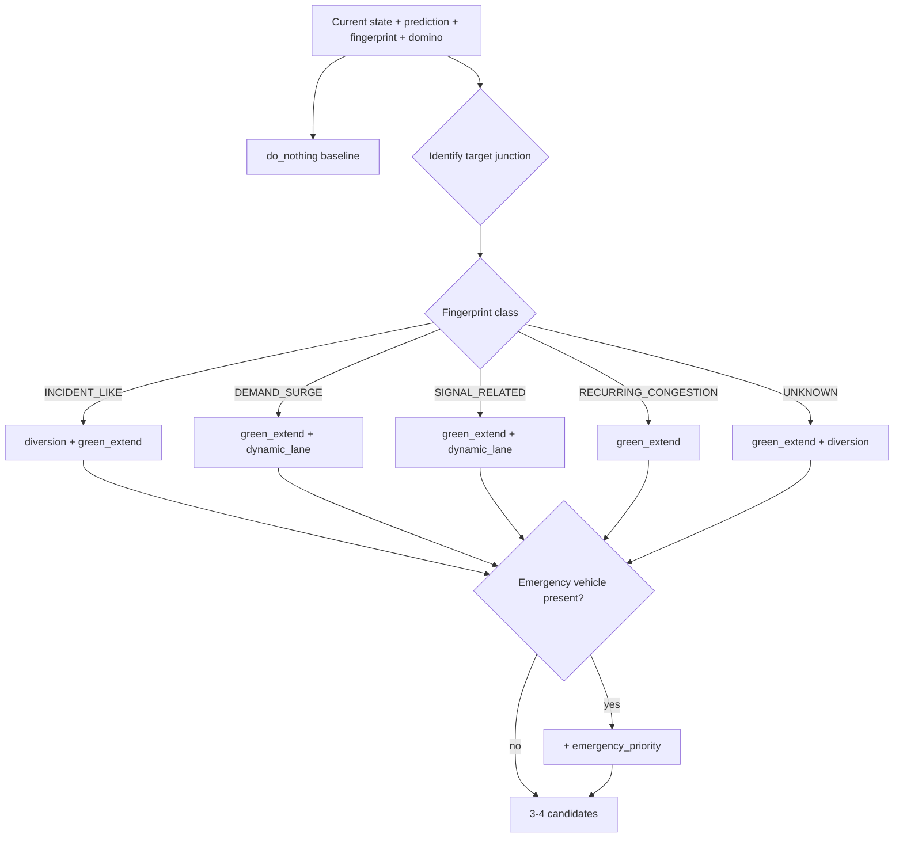

# STRATEGY ENGINE

| Field | Value |
|---|---|
| Status | Level-1 (authoritative) |
| Priority | P0 — MUST |
| Owner | Laptop 2 |
| Consumers | Strategy panel, Digital Twin, Critic agent |

---

## 1. Purpose

Generate a small set of concrete, parameterised, measurable intervention strategies, and score
them against each other on shared metrics. The system never labels an option "best" without
showing the numbers that make it best.

## 2. Scope

Candidate generation from a constrained catalogue and multi-objective scoring of simulated
results. Execution of a strategy on real infrastructure is out of scope — NEXUS-TWIN recommends,
it does not actuate.

## 3. The constrained catalogue

The LLM does not invent traffic control actions. Types are fixed in `shared_config/ids.yaml`:

| Type | Action | Parameters | Bounds |
|---|---|---|---|
| `do_nothing` | Continue current control | — | — |
| `green_extend` | Extend green on the loaded approach | `extension_seconds`, `junction_id` | 5–40 s |
| `diversion` | Divert a share of approach volume to the parallel corridor | `diversion_percent`, `junction_id` | 5–40% |
| `dynamic_lane` | Reassign a lane to the dominant movement | `lane_id`, `junction_id` | Reversible lanes only |
| `emergency_priority` | Pre-empt signals along the emergency corridor | `corridor`, `vehicle_id` | Active emergency vehicle only |

Why constrained: an LLM asked to "propose traffic interventions" will produce plausible-sounding
actions that are physically impossible, legally impermissible, or unsimulatable. A catalogue is
what makes every candidate testable in the Digital Twin and defensible to a traffic engineer.

## 4. Generation



Target junction selection: highest `congestion_probability` from the prediction map; falling back
to the highest current queue when predictions are unavailable. This matches the behaviour already
implemented in `StrategyGenerator`.

Parameterisation is state-dependent, not fixed:

| Parameter | Derivation |
|---|---|
| `extension_seconds` | `clamp(queue_length_m / saturation_flow_m_per_s, 5, 40)` |
| `diversion_percent` | `clamp(excess_demand / approach_demand · 100, 5, 40)` |

**Rules.** `do_nothing` is always included and always first — without a control condition,
"improvement" has no referent. Between three and four candidates: fewer looks arbitrary, more
overloads the comparison and the timebox.

## 5. Scoring

Each candidate is simulated (`07_SIMULATION/DIGITAL_TWIN_SPEC.md`) and scored:

```
score = w_delay·predicted_delay_s
      + w_queue·predicted_queue_m
      + w_spillback·spillback_penalty
      + w_emissions·predicted_emissions
      + w_emergency·predicted_emergency_delay_s
```

Weights from `configs/optimization_weights.json`, currently in use:

| Term | Weight | Rationale |
|---|---|---|
| delay | 1.0 | Primary operational cost |
| queue | 1.0 | Physical congestion |
| spillback | 1.5 | Network damage costs more than local delay |
| emissions | 0.5 | Secondary objective |
| emergency | 3.0 | Blocking an ambulance is the worst outcome available |

**Lower score wins.**

### Spillback penalty

```python
penalty = sum(max(0, candidate.queue[j] - do_nothing.queue[j]) for j in junctions)
```

Any junction made worse than the no-action baseline contributes its excess. This single term is
what stops the engine from recommending an action that fixes J2 by destroying J1 — the failure
mode of every purely local optimiser.

### Reported metrics

Each candidate reports: predicted queue, network delay, spillover risk, emergency ETA, and overall
score, plus `delta_vs_baseline` as a fraction. All five are shown in the UI; the score alone is
never shown without its components.

## 6. Three winners, not one

| Category | Selection |
|---|---|
| `overall` | Lowest total score |
| `lowest_spillover` | Lowest spillover risk |
| `best_emergency` | Lowest emergency ETA |

These are frequently different strategies, and that is the point. Surfacing the disagreement is
what makes the trade-off visible to the operator, rather than hiding it inside a weighted sum.

## 7. Output

```json
{
  "strategies": [
    { "strategy_id": "cand_do_nothing", "strategy_type": "do_nothing", "label": "DO NOTHING", "parameters": {}, "description": "Baseline control condition." },
    { "strategy_id": "cand_diversion_25", "strategy_type": "diversion", "label": "DIVERT TRAFFIC", "parameters": { "diversion_percent": 25.0, "junction_id": "J2" }, "description": "Divert 25% of J2 approach volume to the parallel corridor." },
    { "strategy_id": "cand_green_extend_20s", "strategy_type": "green_extend", "label": "EXTEND GREEN", "parameters": { "extension_seconds": 20.0, "junction_id": "J2" }, "description": "Extend green on the loaded approach by 20 s." },
    { "strategy_id": "cand_emergency_priority", "strategy_type": "emergency_priority", "label": "EMERGENCY PRIORITY", "parameters": { "corridor": "J1-J2-J3" }, "description": "Pre-empt signals along the emergency corridor." }
  ]
}
```

## 8. Interfaces

| Interface | Detail |
|---|---|
| API | `POST /api/strategy/generate`; existing `POST /strategy/evaluate` and `/strategy/apply` preserved |
| Tools | `generate_strategies`, `compare_strategies` |
| Contract | `Strategy`, `SimulationResult` |
| Persistence | `strategies`, `simulation_results` |
| Frontend | Strategy panel, Digital Twin comparison |

## 9. Dependencies

Prediction map, fingerprint, domino forecast, corridor graph, Digital Twin, optimizer weights.
Reuses the existing `StrategyGenerator` and `StrategyOptimizer` modules rather than replacing
them.

## 10. Failure modes

| Failure | Behaviour |
|---|---|
| Fingerprint unavailable | Generate the default set: `do_nothing`, `green_extend`, `diversion` |
| Weights config missing | Use the documented defaults hardcoded in `StrategyOptimizer` |
| A simulation fails | Candidate marked `success: false`, excluded from scoring, still listed as unavailable |
| All non-baseline candidates fail | Recommend `do_nothing` and state that no alternative could be evaluated |
| Parameter out of bounds | Clamped, and the clamp recorded in the description |

## 11. Testing

| Test | Assertion |
|---|---|
| `do_nothing` present | Always first in the list |
| Count | 3–4 candidates in every scenario |
| Type validity | Every type is in `ids.yaml` |
| Bounds | Every parameter within its documented range |
| Spillback penalty | A candidate that worsens J1 scores worse than one that does not, all else equal |
| Emergency weighting | With an ambulance present, a strategy raising emergency ETA never wins overall |
| Determinism | Same state, same candidates, same scores |

## 12. Acceptance criteria

1. Candidates vary with fingerprint class — not a fixed list.
2. Parameters derive from the current state.
3. Scoring uses all five terms with the documented weights.
4. Three winner categories reported and displayed.
5. Every candidate shows five metrics plus its delta against baseline.
6. No strategy type outside the catalogue can reach simulation.

## 13. Future work

Learned parameter selection within bounds, combined strategies (diversion plus green extension),
operator-defined custom strategies evaluated through the same pipeline, per-city weight tuning.
