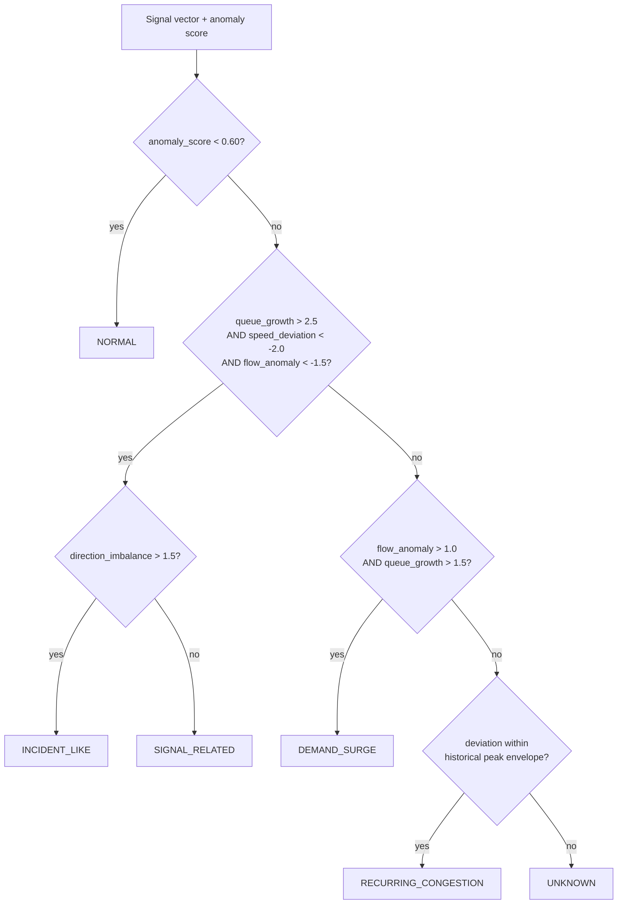

# TRAFFIC FINGERPRINT

| Field | Value |
|---|---|
| Status | Level-1 (authoritative) |
| Priority | P0 — MUST |
| Owner | Laptop 1 |
| Consumers | Fingerprint panel, Strategy Engine, Copilot |

---

## 1. Purpose

Replace "anomaly detected" with a classification of *what kind* of abnormal traffic behaviour is
occurring, together with the signals that support that classification.

The operational reason: a recurring evening peak, a demand surge, a signal fault, and a
lane-blocking collision can produce similar aggregate severity and demand completely different
responses. Severity alone does not tell an operator what to do.

## 2. Scope

Classification of the current state at one junction into one of six classes, with confidence and
supporting signals. This is not incident detection from video, and it does not identify a cause
beyond the class.

## 3. Inputs

| Input | Source |
|---|---|
| Current junction metrics | Traffic State Service |
| Contextual baseline for this intersection-hour-weekend-heading | `baselines.parquet` (Geotab) |
| Anomaly score | Isolation Forest |
| Short-term trajectory (queue delta over the last N steps) | State history buffer |
| Prediction | XGBoost (used only for the escalation qualifier) |

## 4. Signals

Each signal is a z-score of the observed value against its Geotab baseline cell.

| Signal | Definition | Sign convention |
|---|---|---|
| `speed_deviation` | (observed − baseline) speed, z-scored | Negative = slower than expected |
| `waiting_time_deviation` | (observed − baseline) waiting time, z-scored | Positive = worse |
| `queue_growth` | Rate of change of queue length over the recent window, z-scored | Positive = growing |
| `flow_anomaly` | (observed − baseline) throughput, z-scored | Negative = discharge below expectation |
| `direction_imbalance` | Gini-style concentration of queue across approach headings, z-scored | Positive = one approach dominates |

`direction_imbalance` is the signal that separates an incident from a surge, and it exists only
because Geotab records `EntryHeading` per movement. A blockage concentrates delay on one approach;
a demand surge raises several approaches together.

## 5. Classification

Deterministic rule-based classification over the signal vector, gated by the anomaly score. The
determinism is deliberate: a judge asking "why did it say incident?" receives an answer in terms
of named thresholds, not "the model decided".



| Class | Signature | Typical response |
|---|---|---|
| `NORMAL` | Anomaly score below threshold | None |
| `RECURRING_CONGESTION` | Elevated but within the historical envelope for this hour | Signal timing, monitor |
| `INCIDENT_LIKE` | Sharp speed drop, rapid queue growth, reduced discharge, one-directional concentration | Diversion |
| `DEMAND_SURGE` | Inflow above baseline, queue growing, discharge normal or high | Green extension, capacity |
| `SIGNAL_RELATED` | Discharge below baseline with no inflow increase and no directional concentration | Signal correction |
| `UNKNOWN` | Anomalous but matching no signature | Human review |

Key discriminators:

- **Incident vs surge:** flow *down* with queue up (blockage) versus flow *up* with queue up
  (more vehicles arriving).
- **Incident vs signal:** directional concentration. A blockage hits one approach; a signal fault
  reduces discharge symmetrically.
- **Anomalous vs recurring:** whether the deviation exceeds the historical envelope for this
  intersection at this hour on this day type.

## 6. Confidence

```
confidence = 0.5·rule_margin + 0.3·anomaly_score_normalised + 0.2·baseline_support
```

| Term | Meaning |
|---|---|
| `rule_margin` | Distance of the signal vector from the nearest competing class boundary |
| `anomaly_score_normalised` | Isolation Forest score scaled to `[0,1]` |
| `baseline_support` | Confidence in the baseline cell: `min(1, n_samples/100)`, reduced when a fallback level was used |

`baseline_support` matters. A confident classification against a baseline built from eleven
observations is not a confident classification. Thin data lowers confidence rather than being
hidden.

## 7. Output

```json
{
  "junction_id": "J2",
  "type": "INCIDENT_LIKE",
  "confidence": 0.91,
  "signals": [
    { "name": "queue_growth", "value": 0.34, "z_score": 3.4, "contribution": 0.38 },
    { "name": "speed_deviation", "value": -21.6, "z_score": -2.9, "contribution": 0.29 },
    { "name": "direction_imbalance", "value": 0.72, "z_score": 2.2, "contribution": 0.18 },
    { "name": "waiting_time_deviation", "value": 47.7, "z_score": 2.6, "contribution": 0.15 }
  ],
  "alternatives": [{ "type": "DEMAND_SURGE", "confidence": 0.06 }],
  "rationale": "Sharp speed drop with rapid one-directional queue growth and no matching demand increase."
}
```

`contribution` values sum to approximately 1 and drive the bar lengths in the UI. `alternatives`
shows what else was considered — a classifier that never reports a runner-up looks less credible
than one that does.

## 8. Thresholds

All thresholds live in `configs/fingerprint_thresholds.json`, not in code:

```json
{
  "anomaly_gate": 0.60,
  "queue_growth_high": 2.5,
  "speed_deviation_low": -2.0,
  "flow_anomaly_low": -1.5,
  "flow_anomaly_high": 1.0,
  "direction_imbalance_high": 1.5,
  "recurring_envelope_percentile": 90
}
```

Tuned once against the labelled scenario set and then frozen. Tuning thresholds during the demo
window is how a working system becomes an unpredictable one.

## 9. Interfaces

| Interface | Detail |
|---|---|
| API | `POST /api/fingerprint/analyze` |
| Tool | `generate_fingerprint(session_id, junction_id)` |
| Contract | `Fingerprint` in `shared/contracts/fingerprint.ts` |
| Persistence | `traffic_fingerprints` table |
| Frontend | Fingerprint panel; class also colours the map junction badge |

## 10. Dependencies

`baselines.parquet`, the Isolation Forest artifact, and the state history buffer. Requires at
least 5 history steps for `queue_growth`; below that it returns `UNKNOWN` with low confidence
rather than a guess from a single frame.

## 11. Failure modes

| Failure | Behaviour |
|---|---|
| Baseline cell missing | Fall back up the ladder; if none, return `UNKNOWN`, confidence ≤ 0.3 |
| Anomaly model missing | Use a threshold on the raw deviation norm; response flagged `degraded` |
| Insufficient history | `UNKNOWN` with an explanatory rationale |
| Two classes within the margin | Return the higher, list the other in `alternatives`, lower confidence |
| All signals near zero but anomaly high | `UNKNOWN` — never invent a signature |

## 12. Testing

| Test | Assertion |
|---|---|
| Synthetic incident (speed down, queue up one direction, flow down) | `INCIDENT_LIKE`, confidence ≥ 0.8 |
| Synthetic surge (inflow up, flow up, queue up) | `DEMAND_SURGE` |
| Synthetic signal fault (flow down, symmetric, inflow flat) | `SIGNAL_RELATED` |
| Historical peak-hour replay | `RECURRING_CONGESTION`, not `INCIDENT_LIKE` |
| Random noise | `NORMAL` or `UNKNOWN`, never a confident class |
| Determinism | Same input, same output |
| Contract | Output validates against the Pydantic model |

The peak-hour test is the important one. A system that calls every rush hour an incident is worse
than one that says nothing.

## 13. Acceptance criteria

1. All six classes reachable from the test set.
2. Agreement with scenario ground truth ≥ 0.80.
3. Every classification returns at least two supporting signals with contributions.
4. Panel displays type, confidence, signal bars, and rationale.
5. Thresholds externalised in config.

## 14. Future work

Supervised classification once incident-labelled data exists; per-intersection threshold learning;
a `MIXED` class for concurrent causes; temporal fingerprints describing how a pattern evolves
rather than a single snapshot.
