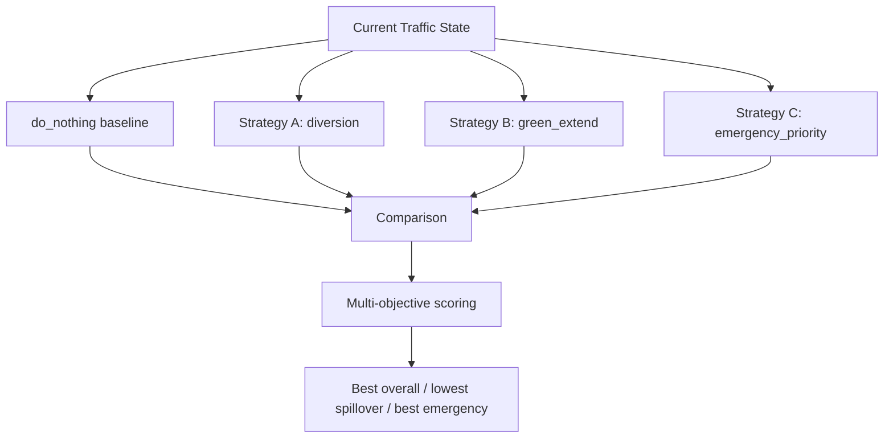

# DIGITAL TWIN SPECIFICATION

| Field | Value |
|---|---|
| Status | Level-1 (authoritative) |
| Priority | P0 — MUST (Phase 1 engine); 3D view is P1; SUMO is FUTURE |
| Owner | Laptop 2 |
| Consumers | Digital Twin panel, Strategy Engine, Critic agent |

---

## 1. Purpose

Provide a **decision-testing environment**, not a 3D visualisation. The Digital Twin answers one
question: what happens to this corridor if we apply strategy X instead of strategy Y?

This is what allows the system to test a recommendation before making it, rather than asserting
one and hoping.

## 2. Scope

Phase 1 is a deterministic Python queue-propagation simulation over the corridor graph. Phase 2
(FUTURE) replaces the engine with SUMO/TraCI behind the same interface. The interface is designed
so that swap requires no change to any caller.

## 3. Interface

```
Input:  TrafficState + Strategy + horizon_seconds
Output: Queue, Delay, Speed, Spillover, Emergency ETA, Network Score
```

```python
def simulate(state: TrafficState, strategy: Strategy, horizon_seconds: int = 180, seed: int = 42) -> ScenarioResult
```

This signature is the contract. Any engine satisfying it is a valid backend.

## 4. Model (Phase 1)

A discrete-time queue model at 1-second resolution over the corridor graph.

Per junction, per approach:

```
queue(t+1) = queue(t) + arrivals(t) - departures(t)
```

| Term | Definition |
|---|---|
| `arrivals(t)` | Baseline demand from Geotab for this intersection-hour-heading, plus upstream departures delayed by link travel time |
| `departures(t)` | `saturation_flow · green_fraction`, capped by queue length and by downstream storage |
| Downstream blocking | If the downstream link is full, departures are throttled — this is what produces spillback rather than assuming it |

Derived metrics:

| Metric | Definition |
|---|---|
| `predicted_queue_m` | Mean queue over the horizon, in metres |
| `predicted_delay_s` | Cumulative vehicle-seconds of delay divided by throughput |
| `predicted_throughput` | Vehicles cleared over the horizon |
| `spillover_risk` | Fraction of horizon steps where any link exceeds 80% storage |
| `emergency_eta_s` | Traversal time for a priority vehicle along J1–J2–J3 |
| `network_score` | `0-100`, normalised from the optimizer score for display |

The model is intentionally simple. A queue model that a teammate can debug at 2 a.m. is worth more
than a microscopic simulation nobody can reason about.

## 5. Strategy effects

Each strategy type modifies specific model parameters. No strategy modifies outputs directly.

| Strategy | Effect |
|---|---|
| `do_nothing` | No modification — the control condition |
| `green_extend` | `green_fraction` for the loaded approach increased by `extension_seconds / cycle_length`; other approaches reduced proportionally |
| `diversion` | `arrivals` on the target approach reduced by `diversion_percent`; the alternate corridor link receives the removed demand |
| `dynamic_lane` | `saturation_flow` for the dominant movement increased by one lane's capacity, reduced for the opposing movement |
| `emergency_priority` | Green forced along the emergency corridor for the traversal duration; cross-street arrivals accumulate |

Every strategy has a cost somewhere in the network, and the model represents it. A strategy that
improved every metric would indicate a modelling error, not a good strategy.

## 6. Determinism

| Requirement | Mechanism |
|---|---|
| Same input, same output | Fixed seed, no wall-clock dependence, no unseeded randomness |
| Reproducible across machines | No thread-count-dependent reductions |
| Verifiable | Checksum test over the demo scenario results |

Determinism is a demo requirement, not just good practice: a judge who sees different numbers on
the second run stops believing the first.

## 7. Comparison



Every candidate simulates from the **same** initial state, over the **same** horizon, with the
**same** seed. Otherwise the comparison is between simulations, not strategies.

`delta_vs_baseline` is computed against `do_nothing` and is the number the UI shows, because
"queue 68 m" means nothing without "down from 118 m".

## 8. Performance

| Requirement | Target |
|---|---|
| Single strategy, 180 s horizon | < 1.5 s |
| Four strategies | < 5 s (sequential is acceptable at this scale) |
| Memory | < 200 MB |

If four strategies exceed 5 s, the API returns `202` with a `simulation_id` and the frontend
polls. Progress is reported per completed strategy so the UI can fill the comparison
incrementally rather than blocking on the slowest.

## 9. Visualisation requirements

| Requirement | Detail |
|---|---|
| Multiple futures | The panel shows current state plus each simulated future, not one table |
| Transition | Animated transition between states, not an instant swap |
| Comparison | Side-by-side metrics with deltas and directional colour |
| Winner highlighting | Three categories highlighted, which may be three different strategies |
| 3D (P1) | Stylised R3F scene showing the chosen future; must never block the 2D path |

## 10. Interfaces

| Interface | Detail |
|---|---|
| API | `POST /api/simulation/run`, `GET /api/simulation/{id}`; existing `/strategy/evaluate` preserved |
| Tools | `simulate_strategy`, `compare_strategies` |
| Contract | `SimulationRun`, `SimulationResult` |
| Persistence | `simulation_runs`, `simulation_results` |
| Internal | `simulate()` as in section 3 |

Output field names match the existing `ScenarioResult` dataclass so the current backend and Unity
client keep working.

## 11. Dependencies

NumPy, NetworkX, the corridor graph, Geotab-derived demand baselines. No SUMO dependency in
Phase 1. Existing SUMO network files in `simulation/network/` are retained for Phase 2.

## 12. Failure modes

| Failure | Behaviour |
|---|---|
| Strategy exceeds its time budget | Return partial metrics, `success: false`, error recorded |
| Graph missing | Fall back to the three-node chain, `degraded: true` |
| Demand baseline missing | Use uniform demand, `degraded: true`, lower confidence downstream |
| Numerical instability (negative queue) | Clamp at zero, log; a test asserts this never occurs on the demo scenario |
| All strategies fail | Return the baseline only; the recommendation becomes `do_nothing` with that stated |

## 13. Testing

| Test | Assertion |
|---|---|
| Determinism | Identical results across two runs with the same seed |
| Conservation | Vehicles in equals vehicles out plus vehicles queued |
| Monotonicity | Higher demand produces longer queues, all else equal |
| Green extension | Increases throughput on the extended approach and reduces it on the others |
| Diversion | Reduces target queue and increases alternate corridor delay |
| Spillback | Full downstream storage throttles upstream departures |
| Emergency priority | Reduces emergency ETA and increases cross-street delay |
| Performance | Four strategies within the 5 s budget |
| Contract | Output validates against the Pydantic model |

The conservation test is the one that catches most modelling bugs. A simulation that loses
vehicles produces optimistic queues and therefore optimistic recommendations.

## 14. Acceptance criteria

1. Four strategies simulate from the same state within the time budget.
2. Results differ meaningfully between strategies — identical outputs indicate the strategy effects
   are not wired in.
3. `delta_vs_baseline` computed against `do_nothing`.
4. Three winner categories reported.
5. Determinism verified by checksum.
6. Conservation test passes.
7. The interface in section 3 is the only coupling to the engine.

## 15. Future work

SUMO/TraCI backend behind the same interface, microscopic vehicle-level simulation, stochastic
runs with confidence intervals, calibration of demand against observed Geotab percentiles,
multi-corridor networks.
