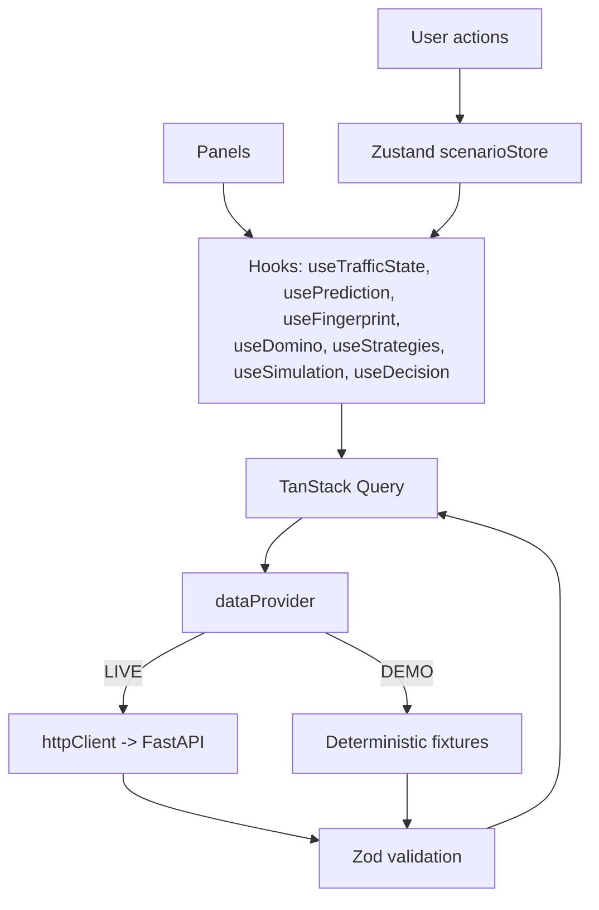

# FRONTEND ARCHITECTURE

| Field | Value |
|---|---|
| Status | Level-1 (authoritative) |
| Owner | Laptop 3 |
| Depends on | `01_PRODUCT/PRD.md`, `04_API/API_DATA_CONTRACTS.md` |

---

## 1. Purpose

Define component boundaries, data flow, and state ownership for the Command Center. This document
covers functionality and structure. Visual design comes later and does not change any boundary
here.

## 2. Scope

Component tree, provider abstraction, state ownership, and rendering rules. Not covered: styling
tokens, animation curves, or 3D scene composition.

## 3. Component tree

```
app/
├── page.tsx                        Landing (already refactored — do not redesign)
└── command-center/page.tsx         Command Center route

components/command-center/
├── CommandCenterShell              Header, layout grid, timeline slot
│
├── TrafficMap
│   ├── JunctionLayer               J1/J2/J3 markers, state colour, pulse
│   ├── LinkLayer                   Road links and lanes
│   ├── VehicleLayer                Animated vehicles by type
│   ├── CongestionLayer             Density shading per link
│   ├── SpilloverLayer              Animated domino arrows
│   └── EmergencyLayer              Ambulance corridor (P1)
│
├── TrafficStatePanel               Five metrics with baseline deltas
├── FingerprintPanel                Type, confidence, signal bars, rationale
├── PredictionPanel                 5-min forecast, current vs predicted
├── DominoPanel                     Ranked spillover list
├── InterventionWindowBanner        Countdown, status, consequence
├── CopilotPanel                    Four-question summary (P0) / chat (P1)
├── StrategyPanel                   Candidates with five metrics each
├── DigitalTwinPanel                Simulation trigger, comparison, winners
├── ExplanationPanel                Action, evidence, confidence, trade-offs, safety
├── DecisionPanel                   Approve / Override / Compare
├── OutcomePanel                    Before vs after
├── CrisisTimeline                  Nine states
└── ProvenanceIndicator             Dataset badge, expandable
```

Every panel is a pure function of props. Panels do not fetch. Fetching happens in hooks, one level
above — this is what makes every panel testable from a fixture and what keeps the DEMO path
honest.

## 4. Data flow



## 5. Provider abstraction

```ts
export interface DataProvider {
  getHealth(): Promise<Health>;
  getTrafficState(sessionId: string, step: number): Promise<TrafficState>;
  predict(sessionId: string, junctionId: JunctionId): Promise<Prediction>;
  detectAnomaly(sessionId: string, junctionId: JunctionId): Promise<AnomalyResult>;
  analyzeFingerprint(sessionId: string, junctionId: JunctionId): Promise<Fingerprint>;
  predictDomino(sessionId: string, source: JunctionId): Promise<DominoForecast>;
  generateStrategies(sessionId: string, junctionId: JunctionId): Promise<Strategy[]>;
  runSimulation(sessionId: string, strategyIds: string[]): Promise<SimulationRun>;
  evaluateDecision(sessionId: string, simulationId: string): Promise<Recommendation>;
  approveDecision(sessionId: string, req: DecisionRequest): Promise<DecisionResult>;
  getProvenance(): Promise<Provenance>;
}
```

Two implementations: `liveProvider` (HTTP) and `demoProvider` (fixtures). Selection happens once
at mount via a health check with a 1.5 s timeout, and can be forced with `?mode=demo`.

**No component may import `httpClient` directly.** The rule exists because the demo must work with
the backend switched off, and a single direct fetch anywhere breaks that guarantee at the worst
possible moment.

## 6. State ownership

| Owner | State | Examples |
|---|---|---|
| Zustand `scenarioStore` | What the user did | `sessionId`, `scenarioStep`, `selectedStrategyId`, `decision`, `mapLayerToggles` |
| TanStack Query | What the server said | Traffic state, prediction, fingerprint, domino, strategies, simulation, recommendation |
| Local `useState` | Ephemeral UI | Hover, expanded sections, dialog open |

Server responses are never copied into Zustand. Two copies of one truth diverge, and the panel
showing the stale copy is always the one on screen when it matters.

```ts
interface ScenarioStore {
  sessionId: string;
  scenarioStep: number;            // 0-8
  scenarioState: ScenarioState;
  selectedStrategyId: string | null;
  decision: 'APPROVE' | 'OVERRIDE' | null;
  mode: DataMode;
  advance(): void;
  reset(): void;
  selectStrategy(id: string): void;
}
```

## 7. Scenario progression

Advancing `scenarioStep` changes which queries are enabled. Panels do not fire until their stage
is reached, which is what makes the demo read as a narrative rather than a wall of data appearing
at once.

| Step | State | Queries enabled |
|---|---|---|
| 0 | NORMAL | traffic state |
| 1 | ANOMALY | + anomaly |
| 2 | FINGERPRINT | + fingerprint |
| 3 | PREDICTION | + prediction |
| 4 | SPILLOVER | + domino, intervention window |
| 5 | RECOMMENDATION | + strategies |
| 6 | SIMULATION | + simulation |
| 7 | DECISION | + recommendation |
| 8 | OUTCOME | + decision result |

Advancing is driven by an explicit control, not a timer. The presenter, not a stopwatch, controls
the pace of the demo.

## 8. Map architecture

| Concern | Approach |
|---|---|
| Base | MapLibre GL JS with OpenStreetMap tiles, centred on the real corridor coordinates |
| Junctions | GeoJSON source, circle layer, colour by `state` |
| Links | LineString from `corridor_mapping.json`, width by congestion |
| Vehicles | Animated symbol layer, positions interpolated with Turf.js along links |
| Spillover | Animated line-dash arrows, one per propagation entry, speed by ETA |
| Fallback | If Deck.gl integration fails, plain MapLibre GeoJSON layers — the domino visual must not depend on it |

Vehicle animation is decorative and must degrade gracefully: dropping to fewer vehicles at low
frame rates is acceptable, dropping the domino arrows is not.

## 9. Rendering rules

| Rule | Detail |
|---|---|
| No `Math.random()` in any demo-critical path | Vehicle jitter only, seeded |
| Every async surface has a skeleton and a fallback | 3 s timeout, then fixture |
| Every number has a unit | Formatting helpers in `lib/format.ts` |
| Probabilities formatted at the edge | `formatPct(0.87) -> '87%'`; the wire stays fractional |
| No dead controls | Every button changes state or shows feedback within 200 ms |
| Readable at 1366×768 | Verified in the release checklist |

## 10. Interfaces

| Interface | Detail |
|---|---|
| Backend | `04_API/API_SPECIFICATION.md` |
| Types | `shared/contracts/` — imported, never redefined locally |
| Validation | Zod schema per response, parsed at the provider boundary |
| Fixtures | `apps/web/src/lib/demo/*.json`, generated from the same scenario definition as the backend |

## 11. Dependencies

Next.js, React, TypeScript, Tailwind, shadcn/ui, Lucide, Framer Motion, Zustand, TanStack Query,
Zod, Recharts, MapLibre, Turf.js. Deck.gl and R3F are optional. Nothing outside `TECH_STACK.md`.

## 12. Failure modes

| Failure | Behaviour |
|---|---|
| Health check fails | `DEMO` mode; badge switches; demo proceeds |
| Response fails Zod | Log, use the fixture, mark the panel `DEMO` |
| Query timeout | Skeleton for 3 s, then fixture |
| Map tiles unavailable | Solid background with the corridor drawn from local GeoJSON |
| Simulation returns `202` | Poll with progressive rendering per completed strategy |
| WebGL unavailable | 3D panel hidden entirely; 2D path unaffected |

## 13. Testing

- Vitest per panel rendering from a fixture.
- Provider test: `demoProvider` satisfies the same interface and passes the same Zod schemas.
- Playwright: full nine-step demo with the backend stopped.
- Consistency test: fingerprint confidence, prediction risk, domino risks, and recommendation
  evidence agree numerically across panels.
- Viewport test at 1920×1080 and 1366×768.

## 14. Acceptance criteria

1. No component imports `httpClient` directly.
2. The full demo completes in `DEMO` mode.
3. No server data is stored in Zustand.
4. Every panel renders from a committed fixture in isolation.
5. No console errors or unhandled rejections across a full run.
6. The landing page is untouched.

## 15. Future work

SSE subscription replacing polling, 3D twin panel, operator history view, keyboard-driven demo
control, responsive layout below 1366 px.
