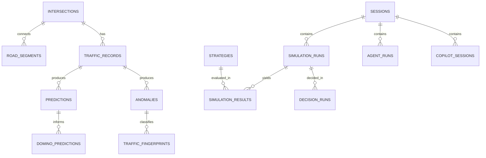

# DATABASE SCHEMA

| Field | Value |
|---|---|
| Status | Level-1 (authoritative) |
| Owner | Laptop 2 |
| Engine | PostgreSQL (current supported major release) |
| ORM | SQLAlchemy 2.x, migrations via Alembic |

---

## 1. Purpose

Persist the corridor definition, model outputs, simulation runs, and operator decisions, so that
any recommendation shown to a judge can be reconstructed afterwards from stored rows.

## 2. Scope

Tables, keys, and relationships for P0 plus the P1 agent tables. Query optimisation and
partitioning are out of scope at this scale.

## 3. Design rules

1. **Nothing on the P0 read path requires the database.** The system runs with PostgreSQL down;
   writes are skipped with a logged warning.
2. Every row that stores a model output also stores the model version and the artifact hash.
3. Timestamps are `timestamptz`, always UTC.
4. Probabilities are `numeric(4,3)` in `[0,1]`, matching the wire contract.
5. Junction identifiers are `varchar(8)` matching `ids.yaml`, not integers.
6. No table stores a value that could be recomputed and displayed instead — persistence is for
   audit, not caching.

## 4. Entity relationships



## 5. Tables

### 5.1 `intersections`

| Column | Type | Notes |
|---|---|---|
| `id` | serial PK | |
| `label` | varchar(8) unique | `J1`, `J2`, `J3` |
| `geotab_intersection_id` | integer | From the Geotab dataset |
| `city` | varchar(64) | |
| `latitude`, `longitude` | double precision | |
| `street_names` | text[] | |
| `capacity_veh_h` | integer | |
| `created_at` | timestamptz | |

Seeded from `corridor_mapping.json`. `geotab_intersection_id` is the auditable link to the
mandatory dataset.

### 5.2 `road_segments`

| Column | Type | Notes |
|---|---|---|
| `id` | serial PK | |
| `from_intersection_id` | FK | |
| `to_intersection_id` | FK | |
| `length_m` | numeric(8,2) | |
| `free_flow_speed_kmh` | numeric(5,2) | |
| `capacity_veh_h` | integer | |
| `storage_veh` | integer | |

Directed. `J1->J2` and `J2->J1` are separate rows.

### 5.3 `traffic_records`

| Column | Type | Notes |
|---|---|---|
| `id` | bigserial PK | |
| `session_id` | varchar(32) | |
| `intersection_id` | FK | |
| `recorded_at` | timestamptz | |
| `sim_time_s` | numeric(10,2) | |
| `scenario_step` | smallint | |
| `queue_length_m`, `avg_speed_kmh`, `avg_waiting_time_s` | numeric | |
| `vehicle_count`, `signal_phase` | integer / smallint | |
| `flow_veh_min`, `density_pct` | numeric | |
| `baseline_queue_m`, `baseline_waiting_s` | numeric | Geotab contextual baseline |
| `deviation` | jsonb | z-scores per signal |
| `data_source` | varchar(16) | `geotab`, `simulation`, `fixture` |

Index: `(session_id, intersection_id, recorded_at desc)`.

### 5.4 `predictions`

| Column | Type | Notes |
|---|---|---|
| `id` | bigserial PK | |
| `session_id`, `intersection_id` | | |
| `traffic_record_id` | FK | |
| `horizon_minutes` | smallint | 5 |
| `congestion_probability`, `confidence` | numeric(4,3) | |
| `predicted_queue_m`, `predicted_avg_speed_kmh` | numeric | |
| `will_congest` | boolean | |
| `model_name`, `model_version`, `model_hash` | varchar | |
| `feature_importances` | jsonb | |

### 5.5 `anomalies`

| Column | Type | Notes |
|---|---|---|
| `id` | bigserial PK | |
| `session_id`, `intersection_id`, `traffic_record_id` | | |
| `is_anomaly` | boolean | |
| `anomaly_score`, `threshold` | numeric(4,3) | |
| `top_deviations` | jsonb | |
| `model_name`, `model_version` | varchar | |

### 5.6 `traffic_fingerprints`

| Column | Type | Notes |
|---|---|---|
| `id` | bigserial PK | |
| `anomaly_id` | FK | |
| `session_id`, `intersection_id` | | |
| `type` | varchar(32) | Enum-constrained |
| `confidence` | numeric(4,3) | |
| `signals` | jsonb | Name, value, z-score, contribution |
| `alternatives` | jsonb | |
| `rationale` | text | |
| `threshold_config_version` | varchar(16) | Which threshold set produced this |

`threshold_config_version` exists because thresholds are tunable; without it, a stored
classification cannot be explained after a config change.

### 5.7 `domino_predictions`

| Column | Type | Notes |
|---|---|---|
| `id` | bigserial PK | |
| `session_id` | | |
| `source_intersection_id` | FK | |
| `source_risk` | numeric(4,3) | |
| `propagation` | jsonb | Array of `{junction_id, risk, eta_minutes, path, mechanism}` |
| `window_status` | varchar(16) | |
| `window_remaining_s` | integer | |
| `window_expires_at` | timestamptz | |

### 5.8 `strategies`

| Column | Type | Notes |
|---|---|---|
| `id` | serial PK | |
| `strategy_key` | varchar(64) unique | `cand_diversion_25` |
| `strategy_type` | varchar(32) | Enum-constrained to `ids.yaml` |
| `label` | varchar(64) | |
| `parameters` | jsonb | |
| `description` | text | |

### 5.9 `simulation_runs`

| Column | Type | Notes |
|---|---|---|
| `id` | serial PK | |
| `simulation_uid` | varchar(32) unique | `sim_a91c` |
| `session_id` | | |
| `horizon_seconds` | integer | |
| `baseline_strategy_key` | varchar(64) | |
| `engine` | varchar(16) | `python_v1` or `sumo` |
| `seed` | integer | |
| `status` | varchar(16) | |
| `started_at`, `completed_at` | timestamptz | |

`engine` and `seed` together make any stored run reproducible.

### 5.10 `simulation_results`

| Column | Type | Notes |
|---|---|---|
| `id` | bigserial PK | |
| `simulation_run_id` | FK | |
| `strategy_id` | FK | |
| `predicted_queue_m`, `predicted_delay_s` | numeric | |
| `predicted_throughput` | integer | |
| `spillover_risk` | numeric(4,3) | |
| `emergency_eta_s` | numeric | |
| `per_junction_metrics` | jsonb | |
| `score` | numeric | Lower is better |
| `delta_vs_baseline` | jsonb | |
| `success` | boolean | |
| `error_message` | text | |

Mirrors the existing `ScenarioResult` dataclass field-for-field.

### 5.11 `decision_runs`

| Column | Type | Notes |
|---|---|---|
| `id` | serial PK | |
| `decision_uid` | varchar(32) unique | |
| `session_id`, `simulation_run_id` | | |
| `recommended_strategy_id`, `applied_strategy_id` | FK | |
| `decision` | varchar(16) | `APPROVE` / `OVERRIDE` |
| `confidence` | numeric(4,3) | |
| `evidence`, `tradeoffs`, `safety` | jsonb | |
| `rationale` | text | |
| `outcome` | jsonb | before / after / delta |
| `operator_note` | text | |
| `decided_at` | timestamptz | |

Storing `recommended` and `applied` separately is what makes AI-vs-human analysis possible after
the fact.

### 5.12 `agent_runs` — P1

| Column | Type | Notes |
|---|---|---|
| `id` | serial PK | |
| `session_id` | | |
| `trigger` | text | |
| `graph_state` | jsonb | Terminal `NexusAgentState` |
| `tool_calls` | jsonb | Full audit trail |
| `errors` | jsonb | |
| `fabrication_suspected` | boolean | |
| `duration_ms` | integer | |

### 5.13 `copilot_sessions` — P1

| Column | Type | Notes |
|---|---|---|
| `id` | serial PK | |
| `session_id` | | |
| `question`, `answer` | text | |
| `agent_run_id` | FK | |
| `citations` | jsonb | |

## 6. Migrations

```bash
alembic revision --autogenerate -m "description"
alembic upgrade head
```

One migration per logical change. Migrations are committed with the code that needs them, never
separately, so a teammate pulling `main` gets a consistent pair.

Seeds: `database/seeds/corridor.sql` populates `intersections` and `road_segments` from
`corridor_mapping.json`, and `strategies` from the catalogue.

## 7. Failure modes

| Failure | Behaviour |
|---|---|
| Database unreachable at startup | App starts; writes disabled; warning logged; reads served from memory |
| Write fails mid-request | Response returned normally; failure logged; `degraded: true` |
| Migration pending | Startup logs a warning and continues; it does not block the demo |
| Enum constraint violated | 422 before the write is attempted |

## 8. Testing

- Migration test: `upgrade head` then `downgrade base` on a clean database.
- Seed test: three intersections and two bidirectional link pairs created.
- Constraint test: an invalid `strategy_type` is rejected.
- Range test: no probability column accepts a value above 1.
- Availability test: full demo passes with PostgreSQL stopped.

## 9. Acceptance criteria

1. All P0 tables created by migration, not by hand.
2. Seeds reproduce the corridor from `corridor_mapping.json`.
3. Demo completes with the database down.
4. Every stored model output carries its model version.
5. `decision_runs` allows full reconstruction of any recommendation.

## 10. Future work

PostGIS geometry columns, time-series partitioning on `traffic_records`, retention policy, an
operator table once authentication exists, materialised views for the outcome dashboard.
