# IMPLEMENTATION MASTER PLAN

| Field | Value |
|---|---|
| Status | Level-1 (authoritative) |
| Owner | Shared |
| Nature | Timeboxed. Phases have stop conditions, not aspirations. |

---

## 1. Purpose

Sequence the work across three people so that a complete P0 story exists before anyone starts a
P1 feature.

## 2. The rule that decides the outcome

> A smaller number of completely working features is worth more than many partially implemented
> ones.

Twenty features at sixty percent is a failed demo. Eleven features at one hundred percent is a
winning one. Every phase below has a stop condition; when it is met, stop and move on rather than
polishing.

## 3. Phase overview

| Phase | Name | Duration | Blocking? |
|---|---|---|---|
| 0 | Foundation | 1–2 h | Yes — blocks everything |
| 1 | Data intelligence | 3–4 h | Blocks 3, 4 |
| 2 | Network intelligence | 2–3 h | Blocks 3 |
| 3 | Decision engine | 2–3 h | Blocks 4 |
| 4 | Digital Twin | 2–3 h | Blocks 6 |
| 5 | Agent layer (P1) | 2–3 h | Blocks nothing |
| 6 | Frontend integration | 4–6 h | Blocks 7 |
| 7 | Release | 2–3 h | — |

Phases 1, 2, 4 (backend) and 6 (frontend) run in parallel across laptops. The frontend does not
wait for the backend: it builds against fixtures from hour one, which is why the provider
abstraction is a Phase 0 deliverable rather than a refinement.

---

## Phase 0 — Foundation

**Owner:** all three, together, in one sitting.

| Task | Owner | Deliverable |
|---|---|---|
| Repository structure per README | All | Directories exist and are committed |
| Branches created | All | `feature/ai-pipeline`, `feature/backend-simulation`, `feature/frontend-command-center` |
| `shared/contracts/` populated | Laptop 3 | Types and Zod schemas from `API_DATA_CONTRACTS.md` |
| Pydantic schemas mirroring contracts | Laptop 2 | `services/api/schemas/` |
| Demo fixtures generated | Laptop 3 | `apps/web/src/lib/demo/*.json`, one per endpoint |
| `.env.example`, `docker-compose.yml` | Laptop 2 | Runs on all three machines |
| FastAPI skeleton with `/api/health` | Laptop 2 | Returns 200 |
| Next.js Command Center route | Laptop 3 | Empty shell renders |

**Stop condition:** every member can run frontend and backend locally, and the shared contracts
are committed to `main`.

Contracts and fixtures are written **before** any feature. They are the interface that lets three
people work without blocking each other, and writing them later means integrating twice.

---

## Phase 1 — Data intelligence (Laptop 1)

```
Dataset ingestion -> Feature engineering -> Baselines -> Prediction -> Anomaly -> Fingerprint
```

| Task | Deliverable | Acceptance |
|---|---|---|
| Ingest and validate Geotab CSV | `validation_report.json` | Gates pass |
| Corridor selection | `corridor_mapping.json` | Three real adjacent intersections |
| Contextual baselines | `baselines.parquet` | Peak > off-peak |
| Feature matrix | `features.parquet` | Leakage test passes |
| Train congestion models | `congestion_model.pkl` | F1 ≥ 0.75 |
| Train anomaly model | `anomaly_model.pkl` | ≥ 0.90 recall on synthetic incidents |
| Fingerprint classifier | `ai/fingerprint/` | Six classes reachable; peak hour is not `INCIDENT_LIKE` |

**Stop condition:** all four intelligence functions callable as plain Python with typed outputs
matching the contracts.

---

## Phase 2 — Network intelligence (Laptop 2)

```
NetworkX graph -> Spillover -> Domino -> Intervention window
```

| Task | Acceptance |
|---|---|
| Build corridor graph from mapping | Directed, bidirectional edges, real lengths |
| Risk propagation | Monotonic decrease with distance; risk in `[0,1]` |
| ETA from link storage and growth | Matches hand computation within 10% |
| Intervention window | Derived from earliest qualifying ETA |

**Stop condition:** `POST /api/domino/predict` returns ranked neighbours with ETAs.

---

## Phase 3 — Decision engine (Laptop 2)

```
Strategies -> Evaluation -> Recommendation -> Explainability
```

| Task | Acceptance |
|---|---|
| Strategy generation | 3–4 candidates, `do_nothing` always first, fingerprint-dependent |
| Multi-objective scoring | Five weighted terms; spillback penalty against baseline |
| Recommendation assembly | Three winner categories |
| Explanation | Six questions answered; every number cited |
| Safety checks | Five checks; `FAIL` blocks approval |

**Stop condition:** `POST /api/decision/evaluate` returns a complete recommendation.

---

## Phase 4 — Digital Twin (Laptop 2)

| Task | Acceptance |
|---|---|
| Queue-propagation engine | Conservation test passes |
| Strategy effects | Each type changes results measurably in the expected direction |
| Comparison and deltas | Same state, same horizon, same seed for all candidates |
| Performance | Four strategies under 5 s |

**Stop condition:** `POST /api/simulation/run` returns four differentiated results.

---

## Phase 5 — Agent layer (Laptop 2) — P1

**Do not start until Phases 1–4 and 6 are complete and the demo runs end to end.**

| Task | Acceptance |
|---|---|
| Tool registry | Twelve typed tools, no LangChain imports in tool modules |
| LangGraph workflow | Five agents, bounded retries |
| Anti-fabrication check | Every number traceable to `tool_calls` |
| Copilot endpoint | Structured answer with citations |

**Stop condition:** deleting `agents/` leaves every P0 endpoint working.

---

## Phase 6 — Frontend integration (Laptop 3)

Build in this order. Each step must run in the browser before the next begins.

| # | Step | Acceptance |
|---|---|---|
| 1 | Command Center shell | Header, grid, timeline slot render |
| 2 | J1–J2–J3 map | Junctions, links, animated vehicles, signal phases |
| 3 | Current state panel | Five metrics with baseline deltas, updating with step |
| 4 | Fingerprint panel | Type, confidence, signal bars |
| 5 | Prediction panel | Current vs predicted, visually distinct |
| 6 | Domino visualisation | Animated arrows with risk and ETA — the differentiating visual |
| 7 | Intervention window | Countdown with status colour |
| 8 | AI recommendation | Action, evidence, confidence |
| 9 | Digital Twin | Simulate trigger, comparison, three winners |
| 10 | Explainability | Five sections, safety check |
| 11 | Human decision | Approve, override, compare |
| 12 | Before/after outcome | Deltas, spillover prevented |
| 13 | Provenance indicator | Dataset, city, intersection IDs |

Steps 4, 6, and 7 — fingerprint, domino, intervention window — get the most visual attention.
They are what a judge cannot see anywhere else; the rest of the interface is table stakes.

**Timebox checkpoints:**

| Elapsed | Must be working |
|---|---|
| 30 min | Steps 1–3 and 5 |
| 90 min | Steps 4, 6, 7, timeline, Copilot summary |
| 180 min | Steps 8–13 |

**Stop condition:** the full nine-state demo runs in `DEMO` mode with no console errors. When this
is met, stop adding features and start polish and reliability.

---

## Phase 7 — Release

| Task | Owner |
|---|---|
| Backend integration switched on; both modes verified | All |
| Cross-panel consistency test | Laptop 3 |
| Failure testing: kill backend, kill database, delete artifacts, mid-demo | All |
| Performance check on demo hardware | All |
| Two full dry runs against the demo script | All |
| Release checklist | Laptop 3 |

**Stop condition:** three consecutive clean demo runs on the demo machine.

---

## 4. Parallelisation

```mermaid
gantt
    dateFormat HH:mm
    axisFormat %H:%M
    section Laptop 1 (AI)
    Phase 0        :00:00, 1h
    Phase 1        :01:00, 4h
    Support        :05:00, 3h
    section Laptop 2 (Backend)
    Phase 0        :00:00, 1h
    Phase 2        :01:00, 3h
    Phase 3        :04:00, 3h
    Phase 4        :07:00, 3h
    Phase 5 (P1)   :10:00, 3h
    section Laptop 3 (Frontend)
    Phase 0        :00:00, 1h
    Phase 6        :01:00, 6h
    Phase 7        :07:00, 3h
```



## 5. Integration points

| When | What | Who |
|---|---|---|
| End of Phase 0 | Contracts and fixtures merged to `main` | All |
| End of Phase 1 | AI functions callable from the API layer | 1 → 2 |
| End of Phase 4 | Backend endpoints live; frontend switches to `LIVE` | 2 → 3 |
| Phase 7 | Full integration | All |

Integrate at the end of each phase, not once at the end. Every deferred integration compounds.

## 6. Failure modes

| Risk | Mitigation |
|---|---|
| A phase overruns | Frontend continues on fixtures; the demo does not depend on `LIVE` mode |
| Model quality below target | Ship the deterministic scenario, state the limitation, keep the pipeline |
| Contract change mid-build | Additive only; contract tests catch drift immediately |
| Merge conflicts | Directory ownership means the three rarely touch the same files |
| Scope creep | Any new feature request is answered with this document |

## 7. Testing gates

| Gate | Before |
|---|---|
| Contract parity tests green | Merging to `main` |
| Backend unit tests green | Phase 3 |
| Determinism tests green | Phase 4 |
| Playwright demo green | Phase 7 |
| Three clean dry runs | Presenting |

## 8. Acceptance criteria

1. All twelve P0 capabilities working end to end.
2. Demo completes with and without the backend.
3. No P1 work started before P0 was complete.
4. Every phase stop condition met and verified by someone other than its author.

## 9. Future work

Phase 8 (SUMO integration), Phase 9 (multi-corridor), Phase 10 (deployment), all post-hackathon.
